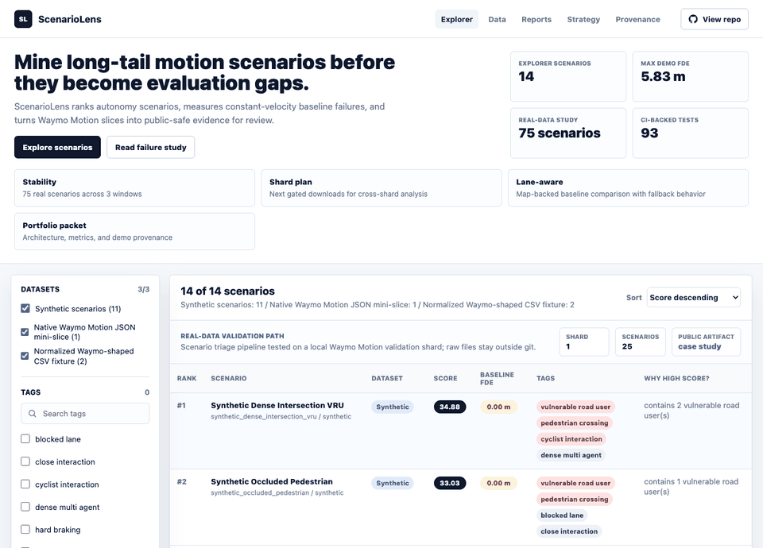
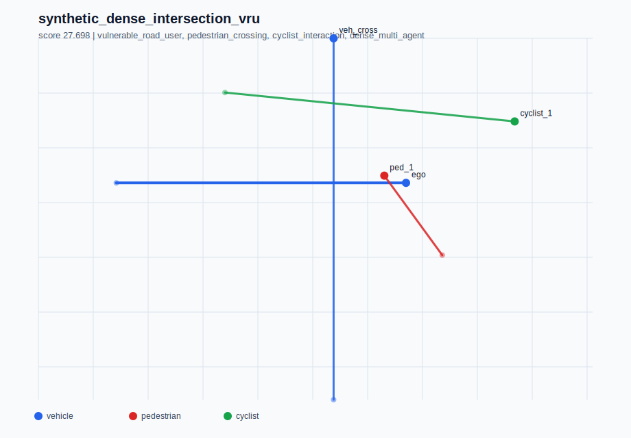
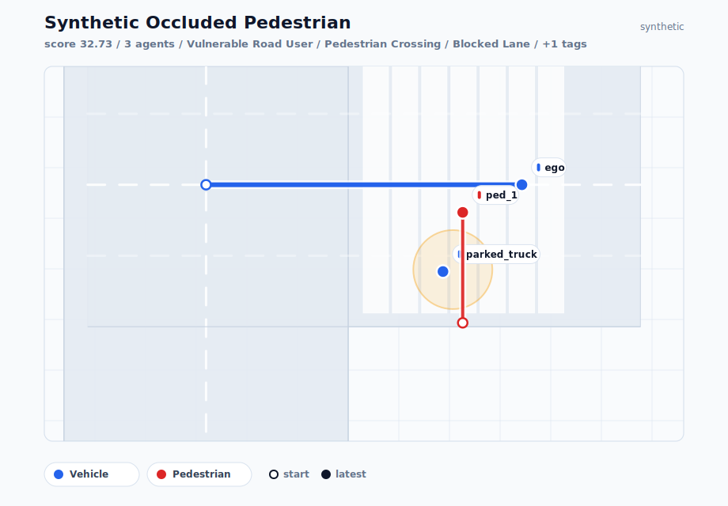
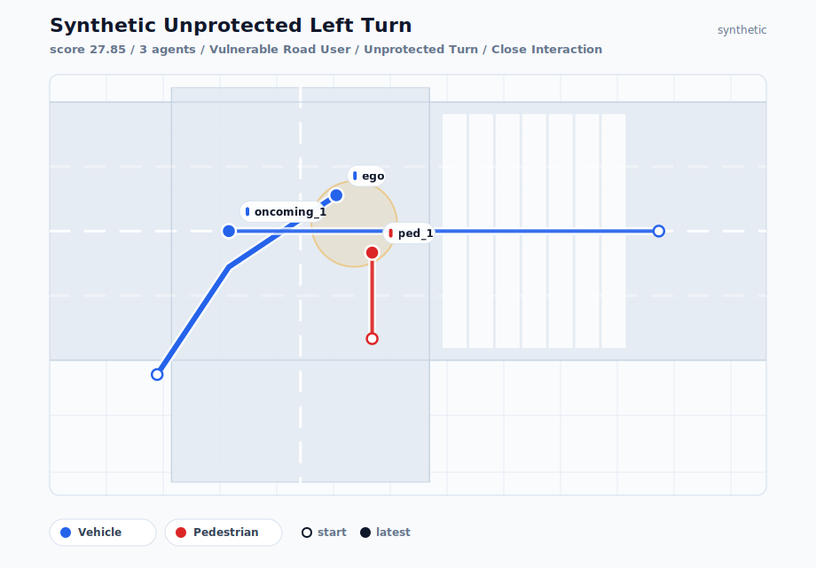

# ScenarioLens

[](https://github.com/ethanvillalovoz/scenariolens/actions/workflows/ci.yml)
[](LICENSE)
[](pyproject.toml)

ScenarioLens is a local-first autonomy evaluation framework for discovering,
ranking, visualizing, and explaining long-tail driving scenarios where simple
prediction baselines fail.

- **Live demo:** [ethanvillalovoz.com/scenariolens](https://ethanvillalovoz.com/scenariolens/)
- **Case study:** [Finding baseline failures in Waymo Motion scenarios](docs/case_studies/waymo_baseline_failures.md)
- **Latest release:** [v0.2.0 notes](docs/releases/v0.2.0.md)

ScenarioLens is designed as a Waymo-targeted portfolio artifact, but the shape
is an engineering product: a reproducible scenario-triage pipeline, real-data
validation workflow, public-safe reports, and a static explorer. Instead of
trying to build a full self-driving stack, ScenarioLens focuses on a problem
that appears across perception, prediction, planning, simulation, and safety
evaluation:

> Which rare driving scenarios deserve targeted evaluation before an autonomous
> driving system is trusted in a new operating domain?

## Project Thesis

Autonomous driving systems do not only need high average performance. They need
evidence that they behave well in rare, interactive, safety-relevant situations:
occlusions, unprotected turns, cyclists, pedestrians, blocked lanes, unusual
merges, and other long-tail cases.

ScenarioLens builds a small but polished pipeline that can:

1. Ingest curated autonomous-driving scenario data.
2. Compute lightweight interaction and risk features.
3. Evaluate constant-velocity and lane-aware trajectory baselines on prediction targets.
4. Tag scenarios by ODD-relevant attributes.
5. Rank scenarios by evaluation value and baseline failure evidence.
6. Present the results in a searchable demo/dashboard.



## Why It Is Credible

| Proof point | Current status |
| --- | --- |
| Working framework | Python package, installable CLI, schema, metrics, reports, rendering, dashboard exporter |
| Real-data path | Native Waymo Motion JSON/proto/TFRecord slice reader with local preflight and validation |
| Baseline evidence | Constant-velocity ADE/FDE, miss rate, lane-aware comparison, map/signal context coverage, map-match audit, tag studies, and stability studies |
| Public demo | Static Scenario Explorer with filters, SVG trajectories, score components, failure cards, and real-data diagnostic cases |
| Repo quality | MIT license, contributor docs, changelog, citation, issue templates, CI, and release checklist |

## Quick Start

```bash
git clone https://github.com/ethanvillalovoz/scenariolens.git
cd scenariolens
python3 -m venv .venv
source .venv/bin/activate
python -m pip install -e .
scenariolens report --format markdown --limit 5
```

Preview the explorer locally:

```bash
python3 -m http.server 8000 --directory docs
```

Then open `http://localhost:8000/demo/`.

## Supported Inputs

| Input | Status | Notes |
| --- | --- | --- |
| Synthetic scenarios | Supported | Deterministic test and demo corpus |
| ScenarioLens JSON | Supported | Stable internal interchange format |
| Row-wise CSV tracks | Supported | Lightweight adapter for custom fixtures |
| Waymo Motion-shaped JSON/CSV | Supported | Checked-in public fixtures |
| Waymo Motion proto/TFRecord slices | Supported for small local slices | Dependency-free reader for the fields ScenarioLens uses |
| Full Waymo-scale benchmark | Not claimed | Raw data remains local and access-gated |

## Public Evidence

- [Portfolio report](docs/reports/portfolio_report.md)
- [Waymo Motion validation summary](docs/reports/waymo_motion_validation_summary.md)
- [Real-slice failure study](docs/reports/waymo_motion_failure_study.md)
- [Failure distribution stability study](docs/reports/waymo_motion_failure_stability.md)
- [Cross-shard failure stability study](docs/reports/waymo_motion_failure_stability_cross_shard.md)
- [Waymo map and signal context study](docs/reports/waymo_context_study_cross_shard.md)
- [Context-joined failure study](docs/reports/waymo_context_failure_study_cross_shard.md)
- [Context evaluation set](docs/reports/waymo_context_eval_set.md)
- [Context eval debug casebook](docs/reports/waymo_context_eval_debug_casebook.md)
- [Context replay candidate plan](docs/reports/waymo_context_replay_candidate_plan.md)
- [Context open-loop replay prototype](docs/reports/waymo_context_open_loop_replay_prototype.md)
- [Context route/intent audit](docs/reports/waymo_context_route_intent_audit.md)
- [Lane-link continuation prototype](docs/reports/waymo_lane_continuation_prototype.md)
- [Lane-continuation validation study](docs/reports/waymo_lane_continuation_study.md)
- [Lane-continuation candidate plan](docs/reports/waymo_lane_continuation_candidate_plan.md)
- [Lane-continuation replay prototype](docs/reports/waymo_lane_continuation_replay_prototype.md)
- [Lane-continuation route diagnostics](docs/reports/waymo_lane_continuation_route_diagnostics.md)
- [Lane-continuation branch selection diagnostic](docs/reports/waymo_lane_continuation_branch_selection.md)
- [Real Waymo lane-aware baseline diagnostic](docs/reports/waymo_lane_aware_baseline_cross_shard.md)
- [Lane-aware baseline debug casebook](docs/reports/waymo_lane_aware_debug_casebook.md)
- [Replay candidate plan](docs/reports/waymo_replay_candidate_plan.md)
- [Open-loop replay prototype](docs/reports/waymo_open_loop_replay_prototype.md)
- [Map-match threshold audit](docs/reports/waymo_map_match_audit.md)
- [Heading-aware lane selection study](docs/reports/waymo_heading_aware_lane_selection_study.md)
- [Heading-aware debug casebook](docs/reports/waymo_heading_aware_debug_casebook.md)
- [Heading-aware replay candidate plan](docs/reports/waymo_heading_aware_replay_candidate_plan.md)
- [Heading-aware replay prototype](docs/reports/waymo_heading_aware_replay_prototype.md)
- [Fixture lane-aware baseline comparison](docs/reports/lane_aware_baseline_study.md)
- [No-auth baseline ablation study](docs/reports/baseline_ablation_study.md)
- [Shard expansion plan](docs/reports/waymo_motion_shard_plan.md)

For the end goal, user, non-goals, and work tracks, see
[docs/project_strategy.md](docs/project_strategy.md). For the data flow and
module boundaries, see [docs/architecture.md](docs/architecture.md). For the
framework vocabulary and copy-paste CLI workflows, see
[docs/framework_concepts.md](docs/framework_concepts.md) and
[docs/cli_workflows.md](docs/cli_workflows.md).

## Why This Is Waymo-Relevant

Waymo's public research ecosystem centers on scenario data, motion forecasting,
simulation, and safety evaluation. ScenarioLens focuses on a narrow, credible
slice of that world: finding high-value driving interactions where a lightweight
forecasting baseline struggles, then turning those failures into reviewable
scenario evidence before deployment in a new operating domain.

The project is intentionally scoped around public Waymo Motion-shaped data,
interpretable metrics, and dependency-light tooling so the core demo remains
reviewable on a laptop.

## Hardware-Conscious Scope

This repo is intentionally scoped for an Apple Silicon laptop with 32 GB RAM and
1 TB storage.

- Work from curated slices, not full raw datasets.
- Store raw dataset files outside git.
- Prefer metadata indexes over repeatedly scanning large files.
- Begin with motion/scenario data before heavy image/LiDAR workloads.
- Make cloud/GPU usage optional, not required for the core demo.

## Tech Stack

ScenarioLens is built around a laptop-friendly subset of the public Waymo and
autonomy ecosystem: Python, Waymo Motion `Scenario`-shaped records, a
dependency-free reader for the Motion fields this project needs, and a future
JAX/Waymax simulation path. See [docs/tech_stack.md](docs/tech_stack.md) for
the full rationale.

## Data Provenance

The checked-in demo currently uses synthetic scenarios plus tiny Waymo
Motion-shaped fixtures. Synthetic data is the test harness, not the final
claim. Separate checked-in reports document public-safe local Waymo Motion
validation slices, lane-aware diagnostics, and replay-readiness experiments,
while raw dataset files and local per-case debug artifacts stay outside git.

See [docs/data_provenance.md](docs/data_provenance.md) for the exact fixture
inventory and [docs/waymo_motion_slice_recipe.md](docs/waymo_motion_slice_recipe.md)
for the real-slice workflow.

## Repo Layout

```text
docs/                 Project brief, reports, examples, and static explorer
docs/demo/            Scenario Explorer UI, payload, screenshot, and SVG assets
docs/project_strategy.md
                      Product strategy, target user, non-goals, and work tracks
docs/architecture.md  Data flow, module map, scoring boundary, and artifacts
docs/cli_workflows.md Copy-paste CLI workflows for common analysis paths
src/scenariolens/     Lightweight Python package
tests/                Unit tests for ingestion, metrics, reports, and dashboard data
data/                 Local data mount points, ignored by git
.github/workflows/    CI checks for tests and static demo JavaScript
```

## Current State

The current milestone is a complete local scenario-triage product on synthetic
records, Waymo-shaped fixtures, and a public-safe local Waymo Motion validation
smoke test. The prototype can:

- define a compact scenario schema,
- compute lightweight risk/interaction features,
- compute constant-velocity baseline ADE/FDE, miss rate, and failure score,
- break rankings into interpretable score components,
- normalize and infer scenario taxonomy tags,
- rank 11 synthetic scenarios by evaluation value,
- ingest protobuf-shaped Waymo Motion JSON mini-slices,
- diagnose local Waymo Motion data/tooling readiness,
- preflight local Waymo Motion slice folders before ingestion,
- generate a reproducible local Waymo Motion validation packet,
- preserve Waymo prediction-target and object-of-interest metadata,
- score real slices through a quality-filtered, ego-centered context,
- save/load ScenarioLens scenario JSON,
- export Markdown or JSON reports,
- render 2D SVG trajectory views,
- generate public-safe failure, distribution-stability, and baseline-comparison studies,
- compare constant-velocity and lane-aware baselines across 100 real scenarios
  from four local Waymo Motion validation shards,
- auto-select lane-aware improvement, regression, and fallback-heavy cases for
  local baseline debugging,
- produce a replay candidate queue for downstream replay/simulation work,
- run an open-loop replay and perturbation prototype for two replay-ready real
  Waymo scenarios,
- audit a fallback-heavy real Waymo case with a map-match threshold sweep before
  changing matcher behavior,
- compare nearest-lane and heading-aware lane selection across 100 real Waymo
  scenarios without changing the default scoring baseline,
- summarize static map features, traffic-signal lane states, stop points, and
  lane-topology hints across the same 100-scenario local Waymo slice,
- join map/signal context with baseline failure, lane-aware fallback, and
  lane-regression diagnostics for context-rich case selection,
- turn context-joined failures into a 14-scenario public-safe evaluation set
  with signal, route/topology, lane-regression, and fallback-stress groups,
- reload the top context evaluation seeds into a public-safe debug casebook and
  replay-candidate queue with two replay-ready cases and three map-match audits,
- run a context open-loop replay prototype over those two replay-ready cases,
  preserving one stable regression warning and flagging one sensitive positive
  control under deterministic anchor perturbations,
- audit the stable context replay warning for lane continuity, heading
  selection, and route/topology hints, identifying a concrete lane-continuation
  follow-up instead of widening the matcher,
- run a lane-link continuation prototype that proves the linked-lane follow-up
  on a deterministic fixture, resolves the real warning's parsed lane chain,
  and cuts nearest-lane FDE by 63.578 m on that stable case,
- scan the same 100-scenario local Waymo slice for 178 lane-continuation
  candidates, where linked lanes improve 96 targets and expose 47 regressions
  plus 33 topology gaps for follow-up audits,
- turn those continuation-study rows into 15 replay/audit candidates: 5
  improvement controls, 5 regression debug targets, and 5 topology-audit
  blockers,
- execute the full lane-continuation candidate queue as a laptop-safe replay
  prototype: 10 target-track replays, 40 deterministic perturbation trials,
  100% sign preservation, and 5 confirmed topology blockers,
- classify those replayed continuation cases into route/topology follow-up
  buckets: 3 stable route-choice regressions, 1 horizon-limit case, 1
  link-worse-than-constant-velocity case, and 5 topology blockers,
- sweep parsed branch alternatives for the 5 continuation regression
  diagnostics, finding 2 branchable cases, 3 single-chain cases, 2
  motion-context improvements, and 2 oracle upper-bound improvements while
  keeping the anchor-heading selector honest at 0 improvements,
- expose public-safe heading-aware improvement, regression, and fallback-heavy
  cases in the live Scenario Explorer,
- turn heading-aware debug cases into a replay-readiness queue for the next
  nearest-lane vs heading-aware replay experiment,
- run a heading-aware open-loop replay prototype over all five current
  heading-ready real Waymo cases with deterministic perturbation stability
  checks,
- generate static dashboard data and SVG assets,
- serve a static Scenario Explorer from the `docs/` entrypoint,
- run without external dependencies.

The next milestone is to replay the motion-context selected branches under
deterministic perturbations and compare them against the default linked route.

See [docs/project_brief.md](docs/project_brief.md) and
[docs/roadmap.md](docs/roadmap.md).

## Recruiting Packet

For resume bullets, interview talking points, and suggested GitHub repository
metadata, see [docs/recruiting_packet.md](docs/recruiting_packet.md). For the
exact suggested GitHub sidebar metadata, see
[docs/github_metadata.md](docs/github_metadata.md).
For the focused technical story, see
[docs/case_studies/waymo_baseline_failures.md](docs/case_studies/waymo_baseline_failures.md).

## Portfolio Report

For a quick project overview, see the generated
[ScenarioLens Portfolio Report](docs/reports/portfolio_report.md). It summarizes
the ranking pipeline, top synthetic scenarios, normalized Waymo-shaped fixture
results, limitations, and next work.

For the first local real-data smoke run, see the
[Waymo Motion Validation Slice Summary](docs/reports/waymo_motion_validation_summary.md)
and the public-safe
[Waymo Motion Real-Data Case Study](docs/reports/waymo_motion_case_study.md).
For tag-level ADE/FDE and miss-rate analysis, see the
[Waymo Motion Real-Slice Failure Study](docs/reports/waymo_motion_failure_study.md).
For windowed distribution stability over 75 real scenarios, see the
[Waymo Motion Failure Distribution Stability Study](docs/reports/waymo_motion_failure_stability.md).
For true cross-shard distribution stability over 100 real scenarios from four
validation shards, see the
[Waymo Motion Cross-Shard Failure Stability Study](docs/reports/waymo_motion_failure_stability_cross_shard.md).
For the real 100-scenario lane-aware diagnostic over the same four validation
shards, see the
[Waymo Lane-Aware Baseline Cross-Shard Study](docs/reports/waymo_lane_aware_baseline_cross_shard.md).
For a public-safe explanation of the selected improvement, regression, and
fallback-heavy cases from that study, see the
[Waymo Lane-Aware Baseline Debug Casebook](docs/reports/waymo_lane_aware_debug_casebook.md).
For the next experiment queue derived from those cases, see the
[Waymo Replay Candidate Plan](docs/reports/waymo_replay_candidate_plan.md).
For the first open-loop replay and perturbation run over that queue, see the
[Waymo Open-Loop Replay Prototype](docs/reports/waymo_open_loop_replay_prototype.md).
For the fallback-heavy threshold-sensitivity audit, see the
[Waymo Map-Match Audit](docs/reports/waymo_map_match_audit.md).
For the heading-aware lane-selection ablation over the same 100-scenario slice,
see the
[Waymo Heading-Aware Lane Selection Study](docs/reports/waymo_heading_aware_lane_selection_study.md).
For the replay-readiness queue derived from those heading-aware debug cases,
see the
[Waymo Heading-Aware Replay Candidate Plan](docs/reports/waymo_heading_aware_replay_candidate_plan.md).
For the open-loop nearest-lane vs heading-aware replay run over selected
candidates, see the
[Waymo Heading-Aware Replay Prototype](docs/reports/waymo_heading_aware_replay_prototype.md).
For the fixture-level lane-aware prediction baseline comparison, see the
[Lane-Aware Baseline Study](docs/reports/lane_aware_baseline_study.md).
For the no-auth constant-velocity vs lane-aware sensitivity check, see the
[Baseline Ablation Study](docs/reports/baseline_ablation_study.md).
For the current local shard inventory and next expansion commands, see the
[Waymo Motion Shard Expansion Plan](docs/reports/waymo_motion_shard_plan.md).
Raw Waymo files and per-scenario outputs remain untracked.

## Scenario Explorer

Live demo: [ethanvillalovoz.com/scenariolens](https://ethanvillalovoz.com/scenariolens/)

The static Scenario Explorer lives in [docs/demo](docs/demo). It consumes the
checked-in dashboard payload and SVG assets. It also embeds public-safe
heading-aware lane-selection case diagnostics from the local 100-scenario Waymo
study, without exposing raw Waymo records or per-scenario packets. Preview the
local `docs/` entrypoint:

```bash
python3 -m http.server 8000 --directory docs
```

Then open `http://localhost:8000`. The root page redirects to `/demo/`.

The production demo is embedded in the personal portfolio site at
`/scenariolens/`.

## Example Gallery

The current top-ranked synthetic scenarios are checked in under
[docs/examples/top_scenarios](docs/examples/top_scenarios).







## Local Commands

Run the starter demo without installing the package:

```bash
PYTHONPATH=src python3 -m scenariolens.cli demo
```

Generate a ranked Markdown report:

```bash
PYTHONPATH=src python3 -m scenariolens.cli report --format markdown --limit 5
```

Reports include component scores for density, VRU presence, taxonomy,
proximity, screened TTC, VRU proximity, path conflict, and dynamics. They also
include constant-velocity baseline ADE/FDE, miss rate, and failure score, while
separating raw track counts from the quality-filtered scored context used for
ranking real Waymo slices.

Generate a machine-readable JSON report:

```bash
PYTHONPATH=src python3 -m scenariolens.cli report --format json --limit 5
```

Compare the constant-velocity and lane-aware prediction baselines:

```bash
PYTHONPATH=src python3 -m scenariolens.cli baseline-compare \
  --format markdown \
  --limit 8 \
  --output docs/reports/lane_aware_baseline_study.md
```

Run the real four-shard lane-aware diagnostic:

```bash
PYTHONPATH=src python3 -m scenariolens.cli baseline-compare-study \
  --input data/raw/waymo/motion/validation/validation.tfrecord-00007-of-00150 \
  --input data/raw/waymo/motion/validation/validation.tfrecord-00008-of-00150 \
  --input data/raw/waymo/motion/validation/validation.tfrecord-00009-of-00150 \
  --input data/raw/waymo/motion/validation/validation.tfrecord-00010-of-00150 \
  --output-dir data/processed/waymo_lane_aware_baseline_cross_shard \
  --max-scenarios 25 \
  --top 10 \
  --public-report docs/reports/waymo_lane_aware_baseline_cross_shard.md
```

Generate local debug overlays from the real study manifest:

```bash
PYTHONPATH=src python3 -m scenariolens.cli baseline-debug \
  --study-manifest data/processed/waymo_lane_aware_baseline_cross_shard/manifest.json \
  --output-dir data/processed/waymo_lane_aware_debug_casebook \
  --case-count 3 \
  --public-report docs/reports/waymo_lane_aware_debug_casebook.md
```

Generate the public-safe replay candidate queue:

```bash
PYTHONPATH=src python3 -m scenariolens.cli replay-candidates \
  --debug-manifest data/processed/waymo_lane_aware_debug_casebook/manifest.json \
  --output-dir data/processed/waymo_replay_candidates \
  --public-report docs/reports/waymo_replay_candidate_plan.md
```

Run the laptop-safe open-loop replay prototype:

```bash
PYTHONPATH=src python3 -m scenariolens.cli replay-prototype \
  --candidate-manifest data/processed/waymo_replay_candidates/manifest.json \
  --output-dir data/processed/waymo_replay_prototype \
  --top 2 \
  --public-report docs/reports/waymo_open_loop_replay_prototype.md
```

Audit fallback-heavy map matching before changing lane-match behavior:

```bash
PYTHONPATH=src python3 -m scenariolens.cli map-match-audit \
  --debug-manifest data/processed/waymo_lane_aware_debug_casebook/manifest.json \
  --output-dir data/processed/waymo_map_match_audit \
  --case-count 1 \
  --public-report docs/reports/waymo_map_match_audit.md
```

Run the real heading-aware lane-selection ablation:

```bash
PYTHONPATH=src python3 -m scenariolens.cli lane-selection-study \
  --input data/raw/waymo/motion/validation/validation.tfrecord-00007-of-00150 \
  --input data/raw/waymo/motion/validation/validation.tfrecord-00008-of-00150 \
  --input data/raw/waymo/motion/validation/validation.tfrecord-00009-of-00150 \
  --input data/raw/waymo/motion/validation/validation.tfrecord-00010-of-00150 \
  --output-dir data/processed/waymo_lane_selection_study \
  --max-scenarios 25 \
  --top 10 \
  --public-report docs/reports/waymo_heading_aware_lane_selection_study.md
```

Generate the heading-aware debug casebook and local artifacts:

```bash
PYTHONPATH=src python3 -m scenariolens.cli baseline-debug \
  --study-manifest data/processed/waymo_lane_selection_study/manifest.json \
  --output-dir data/processed/waymo_heading_aware_debug_casebook \
  --case-count 6 \
  --public-report docs/reports/waymo_heading_aware_debug_casebook.md
```

Turn the heading-aware casebook into a replay-readiness queue:

```bash
PYTHONPATH=src python3 -m scenariolens.cli replay-candidates \
  --debug-manifest data/processed/waymo_heading_aware_debug_casebook/manifest.json \
  --output-dir data/processed/waymo_heading_aware_replay_candidates \
  --public-report docs/reports/waymo_heading_aware_replay_candidate_plan.md
```

Run the heading-aware replay prototype:

```bash
PYTHONPATH=src python3 -m scenariolens.cli heading-replay-prototype \
  --candidate-manifest data/processed/waymo_heading_aware_replay_candidates/manifest.json \
  --output-dir data/processed/waymo_heading_aware_replay_prototype \
  --top 5 \
  --public-report docs/reports/waymo_heading_aware_replay_prototype.md
```

Audit stable context replay regressions for lane-continuity and route-link
follow-up:

```bash
PYTHONPATH=src python3 -m scenariolens.cli route-intent-audit \
  --replay-manifest data/processed/waymo_context_replay_prototype/manifest.json \
  --output-dir data/processed/waymo_context_route_intent_audit \
  --case-count 3 \
  --public-report docs/reports/waymo_context_route_intent_audit.md
```

Prototype lane-link continuation for those audit cases:

```bash
PYTHONPATH=src python3 -m scenariolens.cli lane-continuation-prototype \
  --audit-manifest data/processed/waymo_context_route_intent_audit/manifest.json \
  --output-dir data/processed/waymo_lane_continuation_prototype \
  --case-count 3 \
  --public-report docs/reports/waymo_lane_continuation_prototype.md
```

Scan the local Waymo slice for lane-continuation validation candidates:

```bash
PYTHONPATH=src python3 -m scenariolens.cli lane-continuation-study \
  --input data/raw/waymo/motion/validation/validation.tfrecord-00007-of-00150 \
  --input data/raw/waymo/motion/validation/validation.tfrecord-00008-of-00150 \
  --input data/raw/waymo/motion/validation/validation.tfrecord-00009-of-00150 \
  --input data/raw/waymo/motion/validation/validation.tfrecord-00010-of-00150 \
  --format native \
  --output-dir data/processed/waymo_lane_continuation_study \
  --max-scenarios 25 \
  --top 10 \
  --public-report docs/reports/waymo_lane_continuation_study.md
```

Turn the continuation study into replay and topology-audit queues:

```bash
PYTHONPATH=src python3 -m scenariolens.cli lane-continuation-candidates \
  --study-manifest data/processed/waymo_lane_continuation_study/manifest.json \
  --output-dir data/processed/waymo_lane_continuation_candidates \
  --top-per-bucket 5 \
  --public-report docs/reports/waymo_lane_continuation_candidate_plan.md
```

Execute the lane-continuation replay and topology probe queue:

```bash
PYTHONPATH=src python3 -m scenariolens.cli lane-continuation-replay-prototype \
  --candidate-manifest data/processed/waymo_lane_continuation_candidates/manifest.json \
  --output-dir data/processed/waymo_lane_continuation_replay_prototype \
  --top-per-bucket 5 \
  --format native \
  --max-scenarios-per-source 25 \
  --public-report docs/reports/waymo_lane_continuation_replay_prototype.md
```

Classify replayed continuation regressions and topology blockers:

```bash
PYTHONPATH=src python3 -m scenariolens.cli lane-continuation-route-diagnostics \
  --replay-manifest data/processed/waymo_lane_continuation_replay_prototype/manifest.json \
  --output-dir data/processed/waymo_lane_continuation_route_diagnostics \
  --top 10 \
  --public-report docs/reports/waymo_lane_continuation_route_diagnostics.md
```

Sweep parsed branch alternatives for the continuation regression diagnostics:

```bash
PYTHONPATH=src python3 -m scenariolens.cli lane-continuation-branch-selection \
  --diagnostics-manifest data/processed/waymo_lane_continuation_route_diagnostics/manifest.json \
  --output-dir data/processed/waymo_lane_continuation_branch_selection \
  --top 5 \
  --max-hops 2 \
  --public-report docs/reports/waymo_lane_continuation_branch_selection.md
```

Run the no-auth baseline ablation:

```bash
PYTHONPATH=src python3 -m scenariolens.cli baseline-ablation \
  --format markdown \
  --output docs/reports/baseline_ablation_study.md
```

Export the synthetic corpus as ScenarioLens JSON:

```bash
PYTHONPATH=src python3 -m scenariolens.cli export-synthetic --output data/processed/synthetic_scenarios.json
```

Run a report from a scenario JSON file:

```bash
PYTHONPATH=src python3 -m scenariolens.cli report \
  --input data/processed/synthetic_scenarios.json \
  --format markdown \
  --limit 5
```

Ingest a small row-wise CSV fixture:

```bash
PYTHONPATH=src python3 -m scenariolens.cli ingest-csv \
  --input data/raw/example_tracks.csv \
  --output data/processed/example_scenarios.json
```

Ingest the checked-in Waymo Motion-shaped normalized fixture:

```bash
PYTHONPATH=src python3 -m scenariolens.cli ingest-waymo-motion \
  --format normalized-csv \
  --input docs/examples/waymo_motion_normalized.csv \
  --output data/processed/waymo_motion_normalized.json
```

Ingest a checked-in protobuf-shaped Waymo Motion JSON mini-slice:

```bash
PYTHONPATH=src python3 -m scenariolens.cli ingest-waymo-motion \
  --format native \
  --input docs/examples/waymo_motion_native_sample.json \
  --output data/processed/waymo_motion_native_sample.json
```

Native JSON ingestion is dependency-free. Binary `.pb`, `.tfrecord`, and
official sharded TFRecord inputs such as `validation.tfrecord-00007-of-00150`
are also parsed by the lightweight built-in Motion reader.

Diagnose local Waymo Motion data readiness:

```bash
PYTHONPATH=src python3 -m scenariolens.cli waymo-motion-doctor \
  --input data/raw/waymo/motion/validation \
  --output data/processed/waymo_motion_readiness.json
```

The doctor command checks the configured raw-data folder, optional Python
packages, `gcloud`/`gsutil`, and common download locations such as Downloads and
Desktop. It exits nonzero until a real ingestable slice is available.

Inspect a local downloaded Waymo Motion slice before ingestion:

```bash
PYTHONPATH=src python3 -m scenariolens.cli waymo-motion-preflight \
  --input data/raw/waymo/motion/validation
```

Generate a reproducible validation packet from a local Waymo Motion slice:

```bash
PYTHONPATH=src python3 -m scenariolens.cli waymo-motion-validate \
  --input data/raw/waymo/motion/validation \
  --output-dir data/processed/waymo_motion_validation_run \
  --max-scenarios 25 \
  --top 5
```

The validation packet includes `preflight.json`, `manifest.json`,
ScenarioLens JSON, a ranked Markdown report, and a top-scenario SVG gallery.

Generate a public-safe real-slice baseline failure study:

```bash
PYTHONPATH=src python3 -m scenariolens.cli failure-study \
  --input data/raw/waymo/motion/validation \
  --output-dir data/processed/waymo_motion_failure_study \
  --max-scenarios 25 \
  --top 10 \
  --public-report docs/reports/waymo_motion_failure_study.md
```

The failure study reports target-weighted ADE/FDE, miss rate by tag, failure by
score component, interaction/FDE quadrants, and the hardest baseline-failure
scenario ids without committing raw Waymo scenario data.

Generate a public-safe failure distribution stability study:

```bash
PYTHONPATH=src python3 -m scenariolens.cli failure-study-stability \
  --input data/raw/waymo/motion/validation \
  --output-dir data/processed/waymo_motion_failure_stability \
  --max-scenarios 75 \
  --window-size 25 \
  --top-tags 10 \
  --min-tag-slices 2 \
  --public-report docs/reports/waymo_motion_failure_stability.md
```

The stability study compares ADE/FDE and miss-rate distributions across
multiple inputs or, when only one shard is local, contiguous scenario windows.

Generate a public-safe plan for the next cross-shard run:

```bash
PYTHONPATH=src python3 -m scenariolens.cli waymo-motion-shard-plan \
  --input data/raw/waymo/motion/validation \
  --output docs/reports/waymo_motion_shard_plan.md \
  --json-output data/processed/waymo_motion_shard_plan.json \
  --next-count 3
```

The shard plan inventories local files, lists the next official GCS shard URIs,
and prints the expanded cross-shard `failure-study-stability` command.

See [docs/waymo_motion_slice_recipe.md](docs/waymo_motion_slice_recipe.md) for
the laptop-friendly real-slice workflow.

Render one scenario as SVG:

```bash
PYTHONPATH=src python3 -m scenariolens.cli render \
  --scenario synthetic_occluded_pedestrian \
  --output /tmp/synthetic_occluded_pedestrian.svg
```

Render a top-ranked scenario gallery:

```bash
PYTHONPATH=src python3 -m scenariolens.cli render --top 3 --output-dir /tmp/scenariolens-gallery
```

Regenerate the checked-in portfolio report:

```bash
PYTHONPATH=src python3 -m scenariolens.cli portfolio-report \
  --output docs/reports/portfolio_report.md \
  --assets-dir docs/reports/assets \
  --top 3
```

Generate the Scenario Explorer dashboard data contract:

```bash
PYTHONPATH=src python3 -m scenariolens.cli dashboard-data \
  --output docs/demo/scenarios.json \
  --assets-dir docs/demo/assets \
  --lane-selection-manifest data/processed/waymo_lane_selection_study/manifest.json
```

Run tests with only the Python standard library:

```bash
PYTHONPATH=src python3 -m unittest discover
```

## Scenario Categories

The first taxonomy covers high-signal autonomy-evaluation cases:

- vulnerable road users,
- pedestrian crossings,
- cyclist interactions,
- merge conflicts,
- unprotected turns,
- blocked lanes,
- stopped vehicles,
- hard braking,
- close interactions,
- dense multi-agent scenes,
- low-interaction baselines.

See [docs/scenario_taxonomy.md](docs/scenario_taxonomy.md).

## Data Format

ScenarioLens JSON is documented in [docs/data_format.md](docs/data_format.md).
Dataset ingestion is documented in [docs/ingestion.md](docs/ingestion.md).
Dashboard data is documented in [docs/demo/README.md](docs/demo/README.md).

## Contributing

See [CONTRIBUTING.md](CONTRIBUTING.md) for local setup, data-safety rules, and
pull request expectations. Public reports should stay aggregate and
license-safe; raw Waymo files stay outside git.

## Citation

If this project helps your autonomy evaluation work, see
[CITATION.cff](CITATION.cff).

## License

ScenarioLens is released under the [MIT License](LICENSE).
