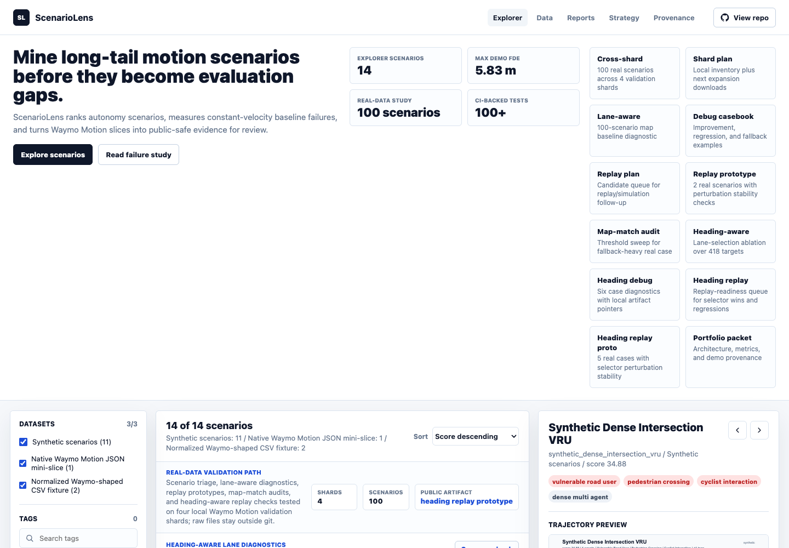

# ScenarioLens

[](https://github.com/ethanvillalovoz/scenariolens/actions/workflows/ci.yml)

ScenarioLens is a local-first autonomous-driving project for discovering, tagging,
and evaluating long-tail driving scenarios.

The project is designed as a Waymo-targeted portfolio artifact: it demonstrates
interest in autonomous driving while staying realistic on a laptop-scale setup.
Instead of trying to build a full self-driving stack, ScenarioLens focuses on a
problem that appears across perception, prediction, planning, simulation, and
safety evaluation:

> Which rare driving scenarios deserve targeted evaluation before an autonomous
> driving system is trusted in a new operating domain?

## Project Thesis

Autonomous driving systems do not only need high average performance. They need
evidence that they behave well in rare, interactive, safety-relevant situations:
occlusions, unprotected turns, cyclists, pedestrians, blocked lanes, unusual
merges, and other long-tail cases.

ScenarioLens builds a small but polished pipeline that can:

1. Ingest curated autonomous-driving scenario data.
2. Compute lightweight interaction and risk features.
3. Tag scenarios by ODD-relevant attributes.
4. Rank scenarios for evaluation value.
5. Present the results in a searchable demo/dashboard.



## Why This Is Waymo-Relevant

Waymo's public research ecosystem centers on scenario data, motion forecasting,
simulation, and safety evaluation. ScenarioLens focuses on a narrow, credible
slice of that world: finding high-value driving interactions that deserve more
targeted evaluation before deployment in a new operating domain.

The project is intentionally scoped around public Waymo Motion-shaped data,
interpretable metrics, and dependency-light tooling so the core demo remains
reviewable on a laptop.

## Hardware-Conscious Scope

This repo is intentionally scoped for an Apple Silicon laptop with 32 GB RAM and
1 TB storage.

- Work from curated slices, not full raw datasets.
- Store raw dataset files outside git.
- Prefer metadata indexes over repeatedly scanning large files.
- Begin with motion/scenario data before heavy image/LiDAR workloads.
- Make cloud/GPU usage optional, not required for the core demo.

## Tech Stack

ScenarioLens is built around a laptop-friendly subset of the public Waymo and
autonomy ecosystem: Python, Waymo Motion `Scenario`-shaped records, optional
Waymo/TensorFlow ingestion for binary files, and a future JAX/Waymax simulation
path. See [docs/tech_stack.md](docs/tech_stack.md) for the full rationale.

## Data Provenance

The checked-in demo currently uses synthetic scenarios plus tiny Waymo
Motion-shaped fixtures. It does not claim results from a full downloaded Waymo
validation shard. The repo includes a local preflight and ingestion path for
downloaded Waymo Motion slices, while raw dataset files stay outside git.

See [docs/data_provenance.md](docs/data_provenance.md) for the exact fixture
inventory and [docs/waymo_motion_slice_recipe.md](docs/waymo_motion_slice_recipe.md)
for the real-slice workflow.

## Repo Layout

```text
docs/                 Project brief, reports, examples, and static explorer
docs/demo/            Scenario Explorer UI, payload, screenshot, and SVG assets
src/scenariolens/     Lightweight Python package
tests/                Unit tests for ingestion, metrics, reports, and dashboard data
data/                 Local data mount points, ignored by git
.github/workflows/    CI checks for tests and static demo JavaScript
```

## Current Milestone

The first milestone is a complete local prototype on synthetic records and
small Waymo-shaped fixtures. The current prototype can:

- define a compact scenario schema,
- compute lightweight risk/interaction features,
- break rankings into interpretable score components,
- normalize and infer scenario taxonomy tags,
- rank 10 synthetic scenarios by evaluation value,
- ingest protobuf-shaped Waymo Motion JSON mini-slices,
- diagnose local Waymo Motion data/tooling readiness,
- preflight local Waymo Motion slice folders before ingestion,
- generate a reproducible local Waymo Motion validation packet,
- save/load ScenarioLens scenario JSON,
- export Markdown or JSON reports,
- render 2D SVG trajectory views,
- generate static dashboard data and SVG assets,
- serve a static Scenario Explorer from the `docs/` entrypoint,
- run without external dependencies.

The next milestone is to run the same flow on a small downloaded Waymo Motion
validation slice and publish the commands plus a short slice-level summary
without committing raw dataset files.

See [docs/project_brief.md](docs/project_brief.md) and
[docs/roadmap.md](docs/roadmap.md).

## Recruiting Packet

For resume bullets, interview talking points, and suggested GitHub repository
metadata, see [docs/recruiting_packet.md](docs/recruiting_packet.md).

## Portfolio Report

For a quick project overview, see the generated
[ScenarioLens Portfolio Report](docs/reports/portfolio_report.md). It summarizes
the ranking pipeline, top synthetic scenarios, normalized Waymo-shaped fixture
results, limitations, and next work.

## Scenario Explorer

Live demo: [ethanvillalovoz.com/scenariolens](https://ethanvillalovoz.com/scenariolens/)

The static Scenario Explorer lives in [docs/demo](docs/demo). It consumes the
checked-in dashboard payload and SVG assets. Preview the local `docs/`
entrypoint:

```bash
python3 -m http.server 8000 --directory docs
```

Then open `http://localhost:8000`. The root page redirects to `/demo/`.

The production demo is embedded in the personal portfolio site at
`/scenariolens/`.

## Example Gallery

The current top-ranked synthetic scenarios are checked in under
[docs/examples/top_scenarios](docs/examples/top_scenarios).


## Local Commands

Run the starter demo without installing the package:

```bash
PYTHONPATH=src python3 -m scenariolens.cli demo
```

Generate a ranked Markdown report:

```bash
PYTHONPATH=src python3 -m scenariolens.cli report --format markdown --limit 5
```

Reports include component scores for density, VRU presence, taxonomy,
proximity, TTC, VRU proximity, path conflict, and dynamics.

Generate a machine-readable JSON report:

```bash
PYTHONPATH=src python3 -m scenariolens.cli report --format json --limit 5
```

Export the synthetic corpus as ScenarioLens JSON:

```bash
PYTHONPATH=src python3 -m scenariolens.cli export-synthetic --output data/processed/synthetic_scenarios.json
```

Run a report from a scenario JSON file:

```bash
PYTHONPATH=src python3 -m scenariolens.cli report \
  --input data/processed/synthetic_scenarios.json \
  --format markdown \
  --limit 5
```

Ingest a small row-wise CSV fixture:

```bash
PYTHONPATH=src python3 -m scenariolens.cli ingest-csv \
  --input data/raw/example_tracks.csv \
  --output data/processed/example_scenarios.json
```

Ingest the checked-in Waymo Motion-shaped normalized fixture:

```bash
PYTHONPATH=src python3 -m scenariolens.cli ingest-waymo-motion \
  --format normalized-csv \
  --input docs/examples/waymo_motion_normalized.csv \
  --output data/processed/waymo_motion_normalized.json
```

Ingest a checked-in protobuf-shaped Waymo Motion JSON mini-slice:

```bash
PYTHONPATH=src python3 -m scenariolens.cli ingest-waymo-motion \
  --format native \
  --input docs/examples/waymo_motion_native_sample.json \
  --output data/processed/waymo_motion_native_sample.json
```

Native JSON ingestion is dependency-free. Binary `.pb` and `.tfrecord` inputs
are treated as optional paths that require Waymo/TensorFlow packages.

Diagnose local Waymo Motion data readiness:

```bash
PYTHONPATH=src python3 -m scenariolens.cli waymo-motion-doctor \
  --input data/raw/waymo/motion/validation \
  --output data/processed/waymo_motion_readiness.json
```

The doctor command checks the configured raw-data folder, optional Python
packages, `gcloud`/`gsutil`, and common download locations such as Downloads and
Desktop. It exits nonzero until a real ingestable slice is available.

Inspect a local downloaded Waymo Motion slice before ingestion:

```bash
PYTHONPATH=src python3 -m scenariolens.cli waymo-motion-preflight \
  --input data/raw/waymo/motion/validation
```

Generate a reproducible validation packet from a local Waymo Motion slice:

```bash
PYTHONPATH=src python3 -m scenariolens.cli waymo-motion-validate \
  --input data/raw/waymo/motion/validation \
  --output-dir data/processed/waymo_motion_validation_run \
  --max-scenarios 25 \
  --top 5
```

The validation packet includes `preflight.json`, `manifest.json`,
ScenarioLens JSON, a ranked Markdown report, and a top-scenario SVG gallery.

See [docs/waymo_motion_slice_recipe.md](docs/waymo_motion_slice_recipe.md) for
the laptop-friendly real-slice workflow.

Render one scenario as SVG:

```bash
PYTHONPATH=src python3 -m scenariolens.cli render \
  --scenario synthetic_occluded_pedestrian \
  --output /tmp/synthetic_occluded_pedestrian.svg
```

Render a top-ranked scenario gallery:

```bash
PYTHONPATH=src python3 -m scenariolens.cli render --top 3 --output-dir /tmp/scenariolens-gallery
```

Regenerate the checked-in portfolio report:

```bash
PYTHONPATH=src python3 -m scenariolens.cli portfolio-report \
  --output docs/reports/portfolio_report.md \
  --assets-dir docs/reports/assets \
  --top 3
```

Generate the Scenario Explorer dashboard data contract:

```bash
PYTHONPATH=src python3 -m scenariolens.cli dashboard-data \
  --output docs/demo/scenarios.json \
  --assets-dir docs/demo/assets
```

Run tests with only the Python standard library:

```bash
PYTHONPATH=src python3 -m unittest discover
```

## Scenario Categories

The first taxonomy covers high-signal autonomy-evaluation cases:

- vulnerable road users,
- pedestrian crossings,
- cyclist interactions,
- merge conflicts,
- unprotected turns,
- blocked lanes,
- stopped vehicles,
- hard braking,
- close interactions,
- dense multi-agent scenes,
- low-interaction baselines.

See [docs/scenario_taxonomy.md](docs/scenario_taxonomy.md).

## Data Format

ScenarioLens JSON is documented in [docs/data_format.md](docs/data_format.md).
Dataset ingestion is documented in [docs/ingestion.md](docs/ingestion.md).
Dashboard data is documented in [docs/demo/README.md](docs/demo/README.md).
