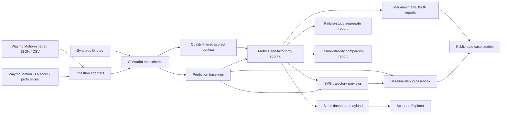

# ScenarioLens Architecture

ScenarioLens is organized around a small, explicit data boundary:

## Components

| Layer | Files | Responsibility |
| --- | --- | --- |
| Schema | `src/scenariolens/schema.py` | Defines the compact scenario, agent, trajectory, and metadata objects used by the rest of the repo. |
| Ingestion | `src/scenariolens/ingest/` | Converts CSV, Waymo Motion-shaped JSON, binary protos, and TFRecord slices into ScenarioLens scenarios. |
| Readiness and validation | `src/scenariolens/waymo_readiness.py`, `src/scenariolens/slice_validation.py` | Checks local dataset setup and produces reproducible validation packets. |
| Metrics | `src/scenariolens/metrics.py` | Computes interpretable interaction features such as density, proximity, TTC, VRU context, path conflict, and dynamics. |
| Prediction baseline | `src/scenariolens/prediction.py` | Evaluates constant-velocity and lane-aware forecasts on Waymo prediction targets or non-ego fixture tracks, producing ADE/FDE, miss rate, failure score, and comparison deltas. |
| Baseline comparison | `src/scenariolens/baseline_compare.py` | Generates public-safe Markdown/JSON comparison reports for constant-velocity versus lane-aware prediction baselines. |
| Baseline debug | `src/scenariolens/baseline_debug.py` | Selects representative baseline-comparison cases and writes ignored local SVG overlays, per-track metric timelines, lane-match diagnostics, and public-safe casebook summaries. |
| Failure study | `src/scenariolens/failure_study.py` | Aggregates ADE/FDE, miss rate, tag-level failures, score-component failures, and hardest scenario ids without publishing raw data. |
| Failure stability | `src/scenariolens/failure_stability.py` | Compares aggregate failure distributions across multiple inputs or contiguous scenario windows to show whether baseline failures are stable. |
| Taxonomy | `src/scenariolens/taxonomy.py` | Normalizes scenario tags and adds category-level ranking signal. |
| Reports | `src/scenariolens/report.py`, `src/scenariolens/portfolio.py` | Generates Markdown/JSON summaries for humans and downstream tools. |
| Rendering | `src/scenariolens/visualize.py` | Produces dependency-free SVG trajectory previews with map context when available. |
| Dashboard | `src/scenariolens/dashboard.py`, `docs/demo/` | Builds and presents deterministic static explorer data. |

## Data Trust Boundary

Raw downloaded Waymo files stay under `data/raw/` and are ignored by git. The
checked-in repo contains only synthetic examples, tiny Waymo Motion-shaped
fixtures, generated demo artifacts, and public-safe aggregate summaries from a
local validation-shard run.

This boundary keeps the repo lightweight and reviewable while still proving the
pipeline can ingest a real public Motion TFRecord shard locally.

## Scoring Boundary

ScenarioLens ranks scenarios by evaluation value and baseline failure evidence,
not by a production model benchmark. The current score is a transparent
heuristic over interpretable features:

- agent density,
- vulnerable-road-user presence,
- minimum same-timestep distance,
- screened constant-velocity TTC,
- vulnerable-road-user proximity,
- sampled path-conflict proximity,
- maximum speed and braking context,
- constant-velocity baseline ADE/FDE, lane-aware comparison deltas, and miss rate,
- scenario taxonomy tags.

The score is designed to help engineers choose cases for deeper review,
baseline evaluation, replay, or simulation. It is not a Waymo benchmark metric.

## Public Artifacts

The public artifact path is:

1. run ingestion or validation,
2. normalize into ScenarioLens JSON,
3. generate ranked reports, SVGs, aggregate failure studies, stability studies,
   and baseline-debug casebooks,
4. publish aggregate summaries, dashboard payloads, and public-safe study reports,
5. keep raw data, local SVG debug overlays, and per-scenario downloaded outputs local.

That gives the repo a production-like workflow without requiring reviewers to
download large datasets before they can understand the project.
