# ScenarioLens Architecture

ScenarioLens is organized around a small, explicit data boundary:

```mermaid
flowchart LR
    A["Synthetic fixtures"] --> D["ScenarioLens schema"]
    B["Waymo Motion-shaped JSON / CSV"] --> C["Ingestion adapters"]
    M["Waymo Motion TFRecord / proto slices"] --> C
    C --> D
    D --> E["Quality-filtered scored context"]
    D --> P["Prediction baselines"]
    E --> F["Metrics and taxonomy scoring"]
    P --> F
    F --> G["Markdown and JSON reports"]
    F --> H["SVG trajectory previews"]
    P --> H
    F --> L["Failure-study aggregate report"]
    F --> N["Failure-stability comparison report"]
    F --> X["Context-failure study"]
    X --> Y["Context evaluation set"]
    Y --> Q
    P --> U["Heading-aware lane-selection study"]
    U --> V["Explorer case diagnostics"]
    U --> W["Heading-aware debug casebook"]
    P --> Q["Baseline-debug casebook"]
    H --> Q
    Q --> R["Replay-candidate plan"]
    R --> S["Open-loop replay prototype"]
    S --> Z["Route/intent audit"]
    Z --> AA["Lane-link continuation prototype"]
    AA --> AB["Lane-continuation validation study"]
    AB --> AC["Continuation replay/audit queue"]
    AC --> AD["Continuation replay prototype"]
    AD --> AE["Continuation route diagnostics"]
    AE --> AF["Continuation branch selection"]
    AF --> AG["Motion-context branch replay"]
    AG --> AH["Branch rollout gate"]
    AH --> AI["Route-context guard study"]
    AI --> AJ["Branch coverage audit"]
    AJ --> AK["Topology gap audit"]
    AK --> AL["Terminal neighborhood audit"]
    AL --> AM["Terminal neighborhood replay gate"]
    Q --> T["Map-match threshold audit"]
    F --> I["Static dashboard payload"]
    V --> I
    I --> J["Scenario Explorer"]
    G --> K["Public-safe case studies"]
    Q --> K
    R --> K
    S --> K
    Z --> K
    AA --> K
    AG --> K
    AJ --> K
    AK --> K
    AL --> K
    AM --> K
    T --> K
    U --> K
    W --> K
    X --> K
    Y --> K
```

## Components

| Layer | Files | Responsibility |
| --- | --- | --- |
| Schema | `src/scenariolens/schema.py` | Defines the compact scenario, agent, trajectory, and metadata objects used by the rest of the repo. |
| Ingestion | `src/scenariolens/ingest/` | Converts CSV, Waymo Motion-shaped JSON, binary protos, and TFRecord slices into ScenarioLens scenarios, preserving a bounded linked-lane closure set beyond the base map-feature cap for continuation diagnostics. |
| Readiness and validation | `src/scenariolens/waymo_readiness.py`, `src/scenariolens/slice_validation.py` | Checks local dataset setup and produces reproducible validation packets. |
| Metrics | `src/scenariolens/metrics.py` | Computes interpretable interaction features such as density, proximity, TTC, VRU context, path conflict, and dynamics. |
| Prediction baseline | `src/scenariolens/prediction.py` | Evaluates constant-velocity and lane-aware forecasts on Waymo prediction targets or non-ego fixture tracks, producing ADE/FDE, miss rate, failure score, and comparison deltas. |
| Context study | `src/scenariolens/context_study.py` | Aggregates public-safe map-feature, traffic-signal, stop-point, and lane-topology coverage from local Waymo Motion slices. |
| Context-failure study | `src/scenariolens/context_failure_study.py` | Joins parsed map/signal context with ScenarioLens scores, baseline FDE, lane-aware deltas, and fallback counts for context-rich case selection. |
| Context evaluation set | `src/scenariolens/context_eval_set.py` | Converts context-failure rankings into grouped, public-safe scenario ID sets with selection reasons, acceptance checks, and follow-up experiment hooks. |
| Baseline comparison | `src/scenariolens/baseline_compare.py` | Generates public-safe Markdown/JSON comparison reports for constant-velocity versus lane-aware prediction baselines. |
| Lane-selection study | `src/scenariolens/lane_selection_study.py` | Compares nearest-lane and heading-aware lane-selection variants across local slices without changing the default scoring baseline. |
| Baseline debug | `src/scenariolens/baseline_debug.py` | Selects representative baseline-comparison, lane-selection, or context-eval-set cases and writes ignored local SVG overlays, per-track metric timelines, lane-match diagnostics, and public-safe casebook summaries. |
| Replay candidates | `src/scenariolens/replay_candidates.py` | Converts baseline-debug, context-eval debug, and heading-aware casebook manifests into public-safe replay-readiness queues with priority scores, blockers, and next actions for Waymax/JAX follow-up work. |
| Replay prototype | `src/scenariolens/replay_prototype.py` | Reloads baseline or context replay-ready local scenarios, reruns open-loop baseline rollouts, applies deterministic anchor-velocity perturbations, and publishes public-safe stability summaries. |
| Route/intent audit | `src/scenariolens/route_intent_audit.py` | Reloads stable replay regressions and diagnoses whether nearest-lane failures are better explained by heading selection, lane continuity, route/topology hints, or manual follow-up. |
| Lane-link continuation | `src/scenariolens/lane_continuation.py` | Prototypes and validates parsed `entry_lanes`/`exit_lanes` continuation for lane-continuity candidates, while keeping the default scoring baseline unchanged. |
| Lane-continuation candidates | `src/scenariolens/lane_continuation_candidates.py` | Turns continuation-study rows into public-safe replay controls, regression debug targets, and topology-audit blockers. |
| Lane-continuation replay | `src/scenariolens/lane_continuation_replay.py` | Reloads queued lane-continuation targets, compares nearest-lane and linked-lane rollouts under deterministic perturbations, and keeps topology blockers separate from replay evidence. |
| Lane-continuation diagnostics | `src/scenariolens/lane_continuation_diagnostics.py` | Classifies replayed linked-lane regressions and topology blockers into route-choice, horizon-limit, and parser/topology follow-up buckets. |
| Lane-continuation branch selection | `src/scenariolens/lane_continuation_branch_selection.py` | Enumerates parsed linked-lane branch alternatives for continuation regressions, compares non-oracle anchor-heading and motion-context selectors with an oracle upper-bound diagnostic, and keeps route-planning claims out of public artifacts. |
| Lane-continuation branch replay | `src/scenariolens/lane_continuation_branch_replay.py` | Replays motion-context branch choices under deterministic anchor perturbations, reports acceptance gates, tests an experimental history-speed prior, and publishes replay/guard diagnostics while keeping route-planning claims out of public artifacts. |
| Branch rollout gate | `src/scenariolens/lane_continuation_branch_rollout.py` | Converts branch replay diagnostics into public-safe promote/hold decisions, separating broader selector-evaluation candidates from route-context and selector-stability holds. |
| Route-context guard study | `src/scenariolens/lane_continuation_route_context_guard.py` | Tests a non-oracle route-context promotion guard over branch-selection candidates, comparing route-fit, endpoint-alignment, and speed-limit-drop cues against branch replay outcomes. |
| Branch coverage audit | `src/scenariolens/lane_continuation_branch_coverage.py` | Joins continuation candidates, replay, route diagnostics, branch selection, branch replay, and route-context guard manifests into a public-safe funnel with bottlenecks and expansion queue items. |
| Lane-continuation topology gap audit | `src/scenariolens/lane_continuation_topology_gap_audit.py` | Reloads topology blocker cases, compares capped ScenarioLens map features with raw parsed map-feature IDs, and identifies cap-recoverable blocker cases versus confirmed terminal lanes. |
| Lane-continuation terminal neighborhood audit | `src/scenariolens/lane_continuation_terminal_neighborhood_audit.py` | Reloads terminal/directional topology blockers, inspects nearby aligned lane alternatives, and separates recoverable selected-lane neighborhoods from directional-link and true-terminal follow-up. |
| Lane-continuation terminal neighborhood replay | `src/scenariolens/lane_continuation_terminal_neighborhood_replay.py` | Force-replays selected terminal lanes against nearby alternate-lane recovery candidates, applies deterministic perturbations, and gates candidates before broader selector experiments. |
| Heading replay prototype | `src/scenariolens/heading_replay_prototype.py` | Reloads heading-ready local scenarios, compares nearest-lane and heading-aware open-loop rollouts, applies deterministic perturbations, and publishes selector stability summaries. |
| Map-match audit | `src/scenariolens/map_match_audit.py` | Reloads fallback-heavy debug cases, sweeps lane-match thresholds, and publishes public-safe evidence about whether wider lane acceptance improves or worsens FDE before changing matcher behavior. |
| Failure study | `src/scenariolens/failure_study.py` | Aggregates ADE/FDE, miss rate, tag-level failures, score-component failures, and hardest scenario ids without publishing raw data. |
| Failure stability | `src/scenariolens/failure_stability.py` | Compares aggregate failure distributions across multiple inputs or contiguous scenario windows to show whether baseline failures are stable. |
| Taxonomy | `src/scenariolens/taxonomy.py` | Normalizes scenario tags and adds category-level ranking signal. |
| Reports | `src/scenariolens/report.py`, `src/scenariolens/portfolio.py` | Generates Markdown/JSON summaries for humans and downstream tools. |
| Rendering | `src/scenariolens/visualize.py` | Produces dependency-free SVG trajectory previews with map context when available. |
| Dashboard | `src/scenariolens/dashboard.py`, `docs/demo/` | Builds and presents deterministic static explorer data, including public-safe lane-selection diagnostic cases when a study manifest is available. |

## Data Trust Boundary

Raw downloaded Waymo files stay under `data/raw/` and are ignored by git. The
checked-in repo contains only synthetic examples, tiny Waymo Motion-shaped
fixtures, generated demo artifacts, and public-safe aggregate summaries from a
local validation-shard run.

This boundary keeps the repo lightweight and reviewable while still proving the
pipeline can ingest a real public Motion TFRecord shard locally.

## Scoring Boundary

ScenarioLens ranks scenarios by evaluation value and baseline failure evidence,
not by a production model benchmark. The current score is a transparent
heuristic over interpretable features:

- agent density,
- vulnerable-road-user presence,
- minimum same-timestep distance,
- screened constant-velocity TTC,
- vulnerable-road-user proximity,
- sampled path-conflict proximity,
- maximum speed and braking context,
- constant-velocity baseline ADE/FDE, lane-aware comparison deltas, and miss rate,
- scenario taxonomy tags.

The score is designed to help engineers choose cases for deeper review,
baseline evaluation, replay, or simulation. It is not a Waymo benchmark metric.

## Public Artifacts

The public artifact path is:

1. run ingestion or validation,
2. normalize into ScenarioLens JSON,
3. generate ranked reports, SVGs, aggregate failure studies, stability studies,
   lane-selection studies, context evaluation sets, baseline-debug casebooks,
   replay-candidate plans, context replay prototypes, open-loop replay prototype
   packets, route/intent audits, lane-link continuation prototypes and studies,
   continuation replay/audit queues, continuation replay prototypes,
   continuation route diagnostics, continuation branch-selection diagnostics,
   motion-context branch replay diagnostics, and map-match audits,
4. publish aggregate summaries, dashboard payloads, and public-safe study reports,
5. keep raw data, local SVG debug overlays, and per-scenario downloaded outputs local.

That gives the repo a production-like workflow without requiring reviewers to
download large datasets before they can understand the project.
