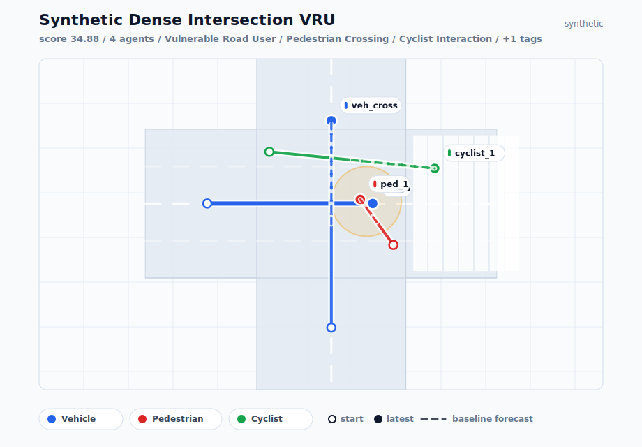
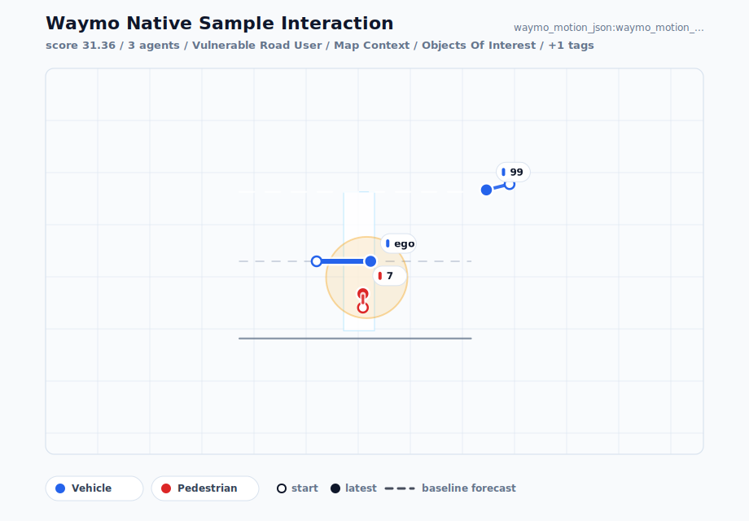
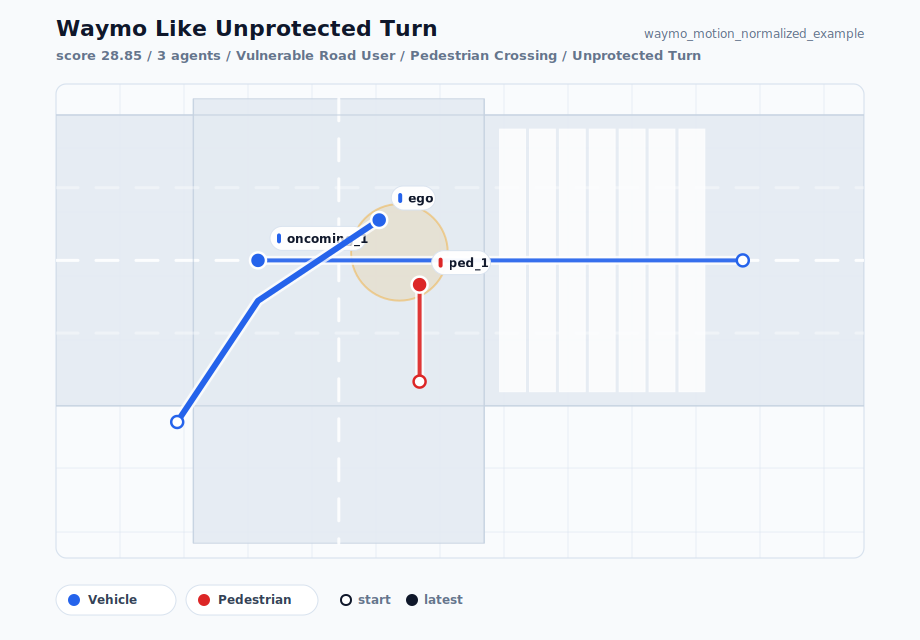
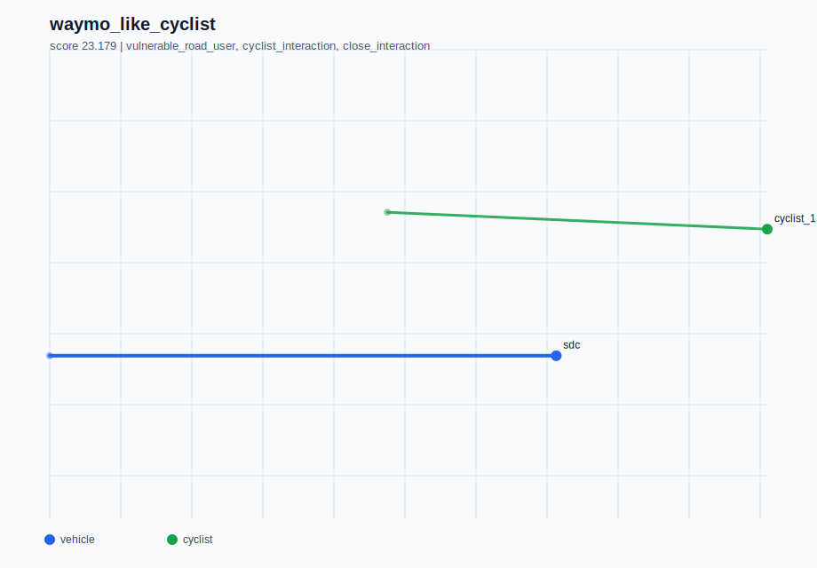

# ScenarioLens Portfolio Report

## Executive Summary

ScenarioLens is a laptop-friendly autonomous-driving evaluation project for discovering and explaining long-tail driving scenarios. It ranks scenarios using lightweight interaction metrics, ODD-relevant taxonomy tags, vulnerable-road-user counts, same-timestep proximity, path-conflict proximity, dynamics, a screened constant-velocity time-to-collision proxy, a constant-velocity prediction baseline with ADE/FDE-style errors, and a lane-aware comparison baseline for map-backed vehicle/cyclist targets.

The current pipeline supports synthetic scenarios, ScenarioLens JSON, row-wise CSV ingestion, normalized Waymo Motion-shaped fixtures, and native Waymo Motion JSON, binary Scenario proto, and small TFRecord slice ingestion. Local slice preflight keeps raw downloaded data separate from the checked-in demo.

## Current Coverage

- Synthetic scenarios analyzed: 11
- Native Waymo-shaped JSON scenarios analyzed: 1
- Normalized Waymo-shaped scenarios analyzed: 2
- Unit tests cover schema I/O, ranking, taxonomy, ingestion, reporting, CLI flows, and SVG rendering.
- Real lane-aware baseline diagnostic is checked in under `docs/reports/waymo_lane_aware_baseline_cross_shard.md`.
- Baseline-debug casebook is checked in under `docs/reports/waymo_lane_aware_debug_casebook.md`.
- Replay candidate plan is checked in under `docs/reports/waymo_replay_candidate_plan.md`.
- Open-loop replay prototype is checked in under `docs/reports/waymo_open_loop_replay_prototype.md`.
- Map-match threshold audit is checked in under `docs/reports/waymo_map_match_audit.md`.
- Heading-aware lane-selection study is checked in under `docs/reports/waymo_heading_aware_lane_selection_study.md`.
- Context evaluation set is checked in under `docs/reports/waymo_context_eval_set.md`.
- Context eval debug casebook is checked in under `docs/reports/waymo_context_eval_debug_casebook.md`.
- Context replay candidate plan is checked in under `docs/reports/waymo_context_replay_candidate_plan.md`.
- Context open-loop replay prototype is checked in under `docs/reports/waymo_context_open_loop_replay_prototype.md`.
- Context route/intent audit is checked in under `docs/reports/waymo_context_route_intent_audit.md`.
- Lane-link continuation prototype is checked in under `docs/reports/waymo_lane_continuation_prototype.md`.
- Lane-continuation validation study is checked in under `docs/reports/waymo_lane_continuation_study.md`.
- Lane-continuation candidate plan is checked in under `docs/reports/waymo_lane_continuation_candidate_plan.md`.
- Lane-continuation replay prototype is checked in under `docs/reports/waymo_lane_continuation_replay_prototype.md`.
- Heading-aware debug casebook is checked in under `docs/reports/waymo_heading_aware_debug_casebook.md`.
- Heading-aware replay candidate plan is checked in under `docs/reports/waymo_heading_aware_replay_candidate_plan.md`.
- Heading-aware replay prototype is checked in under `docs/reports/waymo_heading_aware_replay_prototype.md`.
- Baseline comparison report is generated under `docs/reports/lane_aware_baseline_study.md`.
- Baseline ablation report is generated under `docs/reports/baseline_ablation_study.md`.
- Static dashboard data contract is generated under `docs/demo/`.

## Stack Alignment

ScenarioLens uses a laptop-friendly subset of the public Waymo/autonomy ecosystem: Python for data and evaluation tooling, Waymo Motion `Scenario`-shaped records as the dataset boundary, a lightweight built-in reader for the Motion fields this project needs, and JAX/Waymax as the future simulation path.

## Top Synthetic Scenarios

| Rank | Scenario | Score | Tags |
| ---: | --- | ---: | --- |
| 1 | `synthetic_dense_intersection_vru` | 34.882 | vulnerable_road_user, pedestrian_crossing, cyclist_interaction, dense_multi_agent |
| 2 | `synthetic_occluded_pedestrian` | 33.028 | vulnerable_road_user, pedestrian_crossing, blocked_lane, close_interaction |
| 3 | `synthetic_unprotected_left_turn` | 28.151 | vulnerable_road_user, unprotected_turn, close_interaction |

### 1. `synthetic_dense_intersection_vru`

- Score: 34.882
- Agents: 4
- Scored agents: 4
- Excluded tracks: 0
- Low-quality tracks: 0
- Vulnerable road users: 2
- Scored vulnerable road users: 2
- SDC track present: True
- Prediction targets: 0
- Objects of interest: 0
- Min distance: 0.632 m
- Min VRU distance: 0.632 m
- Min path distance: 0.632 m
- Screened TTC proxy: 0.317 s
- Max speed: 5.000 m/s
- Ego max speed: 4.000 m/s
- Robust max deceleration: n/a
- Prediction target source: non_ego_tracks
- Baseline targets evaluated: 3
- Baseline ADE: 0.000 m
- Baseline FDE: 0.000 m
- Baseline miss rate: 0.0%
- Baseline failure score: 0.450
- Component scores:
  - density: 1.000
  - vru: 3.000
  - taxonomy: 9.000
  - proximity: 7.368
  - ttc: 7.104
  - vru_proximity: 4.776
  - path_conflict: 2.184
  - dynamics: 0.000
  - baseline_failure: 0.450
- Why it matters:
  - contains 2 vulnerable road user(s)
  - minimum agent distance is 0.632 m
  - screened constant-velocity TTC proxy is 0.317 s
  - closest vehicle-to-VRU distance is 0.632 m
  - agent paths come within 0.632 m
  - dense scene with 4 tracked agents (4 scored)
  - high-value taxonomy tags: Vulnerable road user, Pedestrian crossing, Cyclist interaction

### 2. `synthetic_occluded_pedestrian`

- Score: 33.028
- Agents: 3
- Scored agents: 3
- Excluded tracks: 0
- Low-quality tracks: 0
- Vulnerable road users: 1
- Scored vulnerable road users: 1
- SDC track present: True
- Prediction targets: 0
- Objects of interest: 0
- Min distance: 0.510 m
- Min VRU distance: 0.510 m
- Min path distance: 0.510 m
- Screened TTC proxy: 0.500 s
- Max speed: 4.000 m/s
- Ego max speed: 4.000 m/s
- Robust max deceleration: 1.000 m/s^2
- Prediction target source: non_ego_tracks
- Baseline targets evaluated: 2
- Baseline ADE: 0.000 m
- Baseline FDE: 0.000 m
- Baseline miss rate: 0.0%
- Baseline failure score: 0.300
- Component scores:
  - density: 0.750
  - vru: 1.500
  - taxonomy: 9.000
  - proximity: 7.490
  - ttc: 6.875
  - vru_proximity: 4.868
  - path_conflict: 2.245
  - dynamics: 0.000
  - baseline_failure: 0.300
- Why it matters:
  - contains 1 vulnerable road user(s)
  - minimum agent distance is 0.510 m
  - screened constant-velocity TTC proxy is 0.500 s
  - closest vehicle-to-VRU distance is 0.510 m
  - agent paths come within 0.510 m
  - high-value taxonomy tags: Vulnerable road user, Pedestrian crossing, Blocked lane, Close interaction

### 3. `synthetic_unprotected_left_turn`

- Score: 28.151
- Agents: 3
- Scored agents: 3
- Excluded tracks: 0
- Low-quality tracks: 0
- Vulnerable road users: 1
- Scored vulnerable road users: 1
- SDC track present: True
- Prediction targets: 0
- Objects of interest: 0
- Min distance: 1.887 m
- Min VRU distance: 1.887 m
- Min path distance: 1.000 m
- Screened TTC proxy: 0.277 s
- Max speed: 6.000 m/s
- Ego max speed: 3.606 m/s
- Robust max deceleration: 0.181 m/s^2
- Prediction target source: non_ego_tracks
- Baseline targets evaluated: 2
- Baseline ADE: 0.000 m
- Baseline FDE: 0.000 m
- Baseline miss rate: 0.0%
- Baseline failure score: 0.300
- Component scores:
  - density: 0.750
  - vru: 1.500
  - taxonomy: 6.500
  - proximity: 6.113
  - ttc: 7.153
  - vru_proximity: 3.835
  - path_conflict: 2.000
  - dynamics: 0.000
  - baseline_failure: 0.300
- Why it matters:
  - contains 1 vulnerable road user(s)
  - minimum agent distance is 1.887 m
  - screened constant-velocity TTC proxy is 0.277 s
  - closest vehicle-to-VRU distance is 1.887 m
  - agent paths come within 1.000 m
  - high-value taxonomy tags: Vulnerable road user, Unprotected turn, Close interaction

## Lane-Aware Baseline Comparison

This section compares the default constant-velocity predictor with a lightweight lane-aware predictor. Positive improvement means the lane-aware baseline lowered FDE while preserving constant-velocity fallback behavior for unsupported cases.

| Rank | Scenario | CV FDE | Lane FDE | Improvement | Map used | Fallbacks |
| ---: | --- | ---: | ---: | ---: | ---: | ---: |
| 1 | `synthetic_curved_lane_prediction` | 5.831 m | 0.615 m | 5.216 m | 1 | 0 |
| 2 | `synthetic_pedestrian_crossing` | 0.000 m | 0.000 m | 0.000 m | 0 | 1 |
| 3 | `synthetic_dense_merge` | 0.000 m | 0.000 m | 0.000 m | 0 | 3 |

Full report: `docs/reports/lane_aware_baseline_study.md`.
Real-data diagnostic: `docs/reports/waymo_lane_aware_baseline_cross_shard.md`.
Debug casebook: `docs/reports/waymo_lane_aware_debug_casebook.md`.
Replay candidate plan: `docs/reports/waymo_replay_candidate_plan.md`.
Open-loop replay prototype: `docs/reports/waymo_open_loop_replay_prototype.md`.
Map-match threshold audit: `docs/reports/waymo_map_match_audit.md`.
Heading-aware lane-selection study: `docs/reports/waymo_heading_aware_lane_selection_study.md`.
Heading-aware debug casebook: `docs/reports/waymo_heading_aware_debug_casebook.md`.
Heading-aware replay candidate plan: `docs/reports/waymo_heading_aware_replay_candidate_plan.md`.
Heading-aware replay prototype: `docs/reports/waymo_heading_aware_replay_prototype.md`.

## Native Waymo Motion JSON Mini-Slice

This section uses a tiny checked-in JSON record shaped like the public Waymo Motion `Scenario` proto. It exercises native field mapping for timestamps, object types, valid states, velocities, and the SDC ego-track index without requiring a dataset download.

| Rank | Scenario | Score | Tags |
| ---: | --- | ---: | --- |
| 1 | `waymo_native_sample_interaction` | 31.355 | vulnerable_road_user, map_context, objects_of_interest, tracks_to_predict |

### 1. `waymo_native_sample_interaction`

- Score: 31.355
- Agents: 3
- Scored agents: 3
- Excluded tracks: 0
- Low-quality tracks: 0
- Vulnerable road users: 1
- Scored vulnerable road users: 1
- SDC track present: True
- Prediction targets: 1
- Objects of interest: 1
- Min distance: 0.863 m
- Min VRU distance: 0.863 m
- Min path distance: 0.863 m
- Screened TTC proxy: 0.281 s
- Max speed: 5.000 m/s
- Ego max speed: 5.000 m/s
- Robust max deceleration: 10.000 m/s^2
- Prediction target source: waymo_tracks_to_predict
- Baseline targets evaluated: 1
- Baseline ADE: 0.000 m
- Baseline FDE: 0.000 m
- Baseline miss rate: 0.0%
- Baseline failure score: 0.150
- Component scores:
  - density: 0.750
  - vru: 1.500
  - taxonomy: 2.000
  - proximity: 7.137
  - ttc: 7.148
  - vru_proximity: 4.602
  - path_conflict: 2.068
  - dynamics: 6.000
  - baseline_failure: 0.150
- Why it matters:
  - contains 1 vulnerable road user(s)
  - includes 1 Waymo prediction target(s)
  - includes 1 object(s) of interest
  - minimum agent distance is 0.863 m
  - screened constant-velocity TTC proxy is 0.281 s
  - closest vehicle-to-VRU distance is 0.863 m
  - agent paths come within 0.863 m
  - robust max deceleration is 10.000 m/s^2
  - high-value taxonomy tags: Vulnerable road user

## Normalized Waymo-Shaped Fixture Results

These examples use a tiny checked-in CSV shaped like a normalized Waymo Motion extraction. The data is synthetic, but the field boundary exercises row-wise extraction for real Motion slices.

| Rank | Scenario | Score | Tags |
| ---: | --- | ---: | --- |
| 1 | `waymo_like_unprotected_turn` | 29.151 | vulnerable_road_user, pedestrian_crossing, unprotected_turn |
| 2 | `waymo_like_cyclist` | 23.421 | vulnerable_road_user, cyclist_interaction, close_interaction |

### 1. `waymo_like_unprotected_turn`

- Score: 29.151
- Agents: 3
- Scored agents: 3
- Excluded tracks: 0
- Low-quality tracks: 0
- Vulnerable road users: 1
- Scored vulnerable road users: 1
- SDC track present: True
- Prediction targets: 0
- Objects of interest: 0
- Min distance: 1.887 m
- Min VRU distance: 1.887 m
- Min path distance: 1.000 m
- Screened TTC proxy: 0.277 s
- Max speed: 6.000 m/s
- Ego max speed: 3.606 m/s
- Robust max deceleration: 0.181 m/s^2
- Prediction target source: non_ego_tracks
- Baseline targets evaluated: 2
- Baseline ADE: 0.000 m
- Baseline FDE: 0.000 m
- Baseline miss rate: 0.0%
- Baseline failure score: 0.300
- Component scores:
  - density: 0.750
  - vru: 1.500
  - taxonomy: 7.500
  - proximity: 6.113
  - ttc: 7.153
  - vru_proximity: 3.835
  - path_conflict: 2.000
  - dynamics: 0.000
  - baseline_failure: 0.300
- Why it matters:
  - contains 1 vulnerable road user(s)
  - minimum agent distance is 1.887 m
  - screened constant-velocity TTC proxy is 0.277 s
  - closest vehicle-to-VRU distance is 1.887 m
  - agent paths come within 1.000 m
  - high-value taxonomy tags: Vulnerable road user, Pedestrian crossing, Unprotected turn

### 2. `waymo_like_cyclist`

- Score: 23.421
- Agents: 2
- Scored agents: 2
- Excluded tracks: 0
- Low-quality tracks: 0
- Vulnerable road users: 1
- Scored vulnerable road users: 1
- SDC track present: True
- Prediction targets: 0
- Objects of interest: 0
- Min distance: 2.915 m
- Min VRU distance: 2.915 m
- Min path distance: 2.625 m
- Screened TTC proxy: 1.726 s
- Max speed: 6.000 m/s
- Ego max speed: 6.000 m/s
- Robust max deceleration: n/a
- Prediction target source: non_ego_tracks
- Baseline targets evaluated: 1
- Baseline ADE: 0.200 m
- Baseline FDE: 0.200 m
- Baseline miss rate: 0.0%
- Baseline failure score: 0.242
- Component scores:
  - density: 0.500
  - vru: 1.500
  - taxonomy: 6.500
  - proximity: 5.085
  - ttc: 5.343
  - vru_proximity: 3.063
  - path_conflict: 1.188
  - dynamics: 0.000
  - baseline_failure: 0.242
- Why it matters:
  - contains 1 vulnerable road user(s)
  - closest vehicle-to-VRU distance is 2.915 m
  - high-value taxonomy tags: Vulnerable road user, Cyclist interaction, Close interaction

## Limitations

- Checked-in Waymo examples are synthetic mini fixtures, not downloaded real validation shards.
- The lightweight binary reader extracts the Motion fields ScenarioLens needs, not the full Waymo proto surface.
- The TTC value is a screened constant-velocity proxy, not a certified safety metric.
- The prediction baselines are intentionally simple; they are failure-mining screens, not benchmark claims.
- The map-match audit is a threshold-sensitivity diagnostic, not a production map matcher.
- The map/signal context study is aggregate coverage evidence, not a route planner or traffic-light quality audit.
- The context-joined failure study is diagnostic grouping evidence, not a causal claim about map or signal features.
- The context evaluation set is a curated scenario-ID packet, not an official benchmark split.
- The context replay candidate plan is a readiness queue, not completed simulation.
- The context replay prototype is open-loop diagnostic evidence, not closed-loop simulation.
- The context route/intent audit is a diagnostic follow-up, not a route planner.
- The lane-link continuation prototype, validation study, candidate plan, and replay prototype are topology diagnostic evidence, not route planning.
- The heading-aware lane selector is an ablation, not a replacement for the default scorer.
- The heading-aware replay candidate plan is a queue for replay experiments, not completed simulation.
- The heading-aware replay prototype is open-loop diagnostic evidence, not closed-loop simulation.
- The current renderer is 2D and focuses on agent trajectories, map context, and baseline overlays, not traffic-light logic.

## Next Work

- Expand the documented local-slice recipe across more Waymo Motion validation shards.
- Compare baseline ADE/FDE distributions across more validation shards.
- Use replayed lane-continuation regressions and topology blockers for richer route-choice diagnostics.
- Graduate stable open-loop replay candidates into an optional Waymax/JAX path.
- Create curated scenario collections for pedestrian, cyclist, merge, and unprotected-turn cases.
