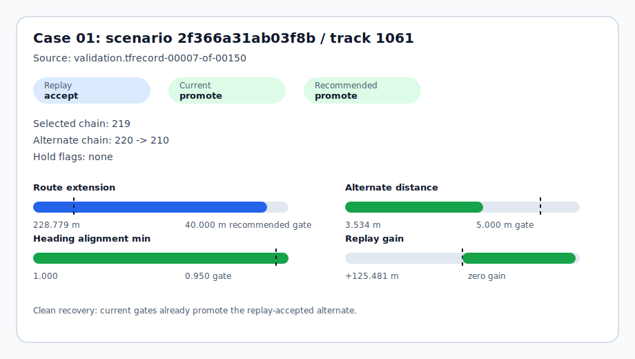
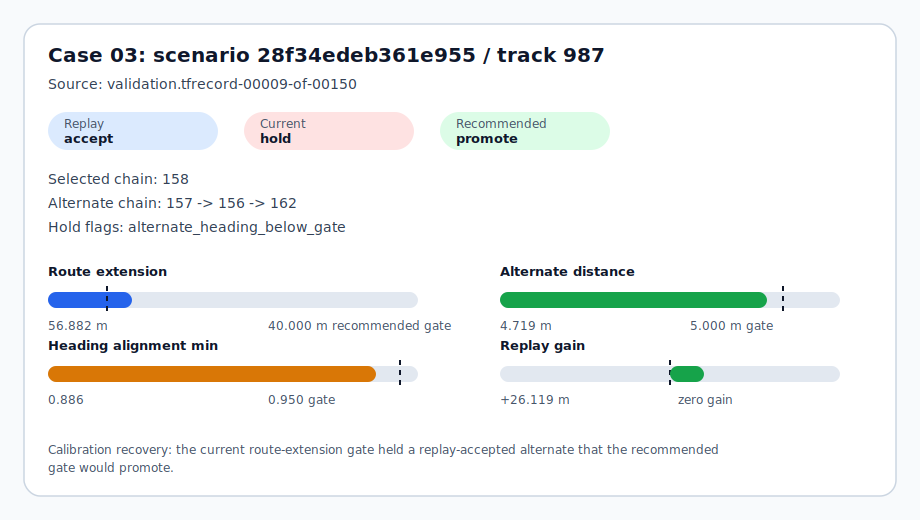
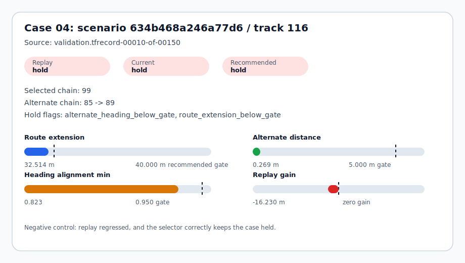
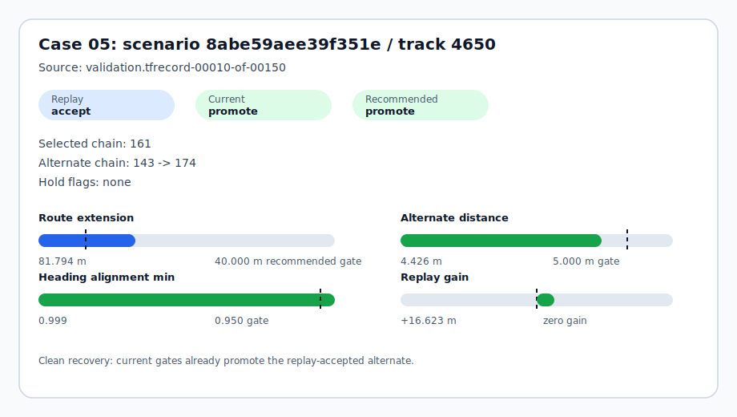
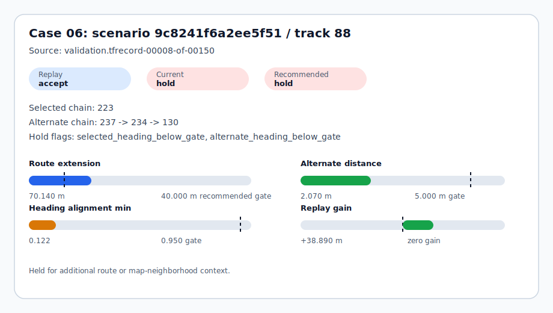
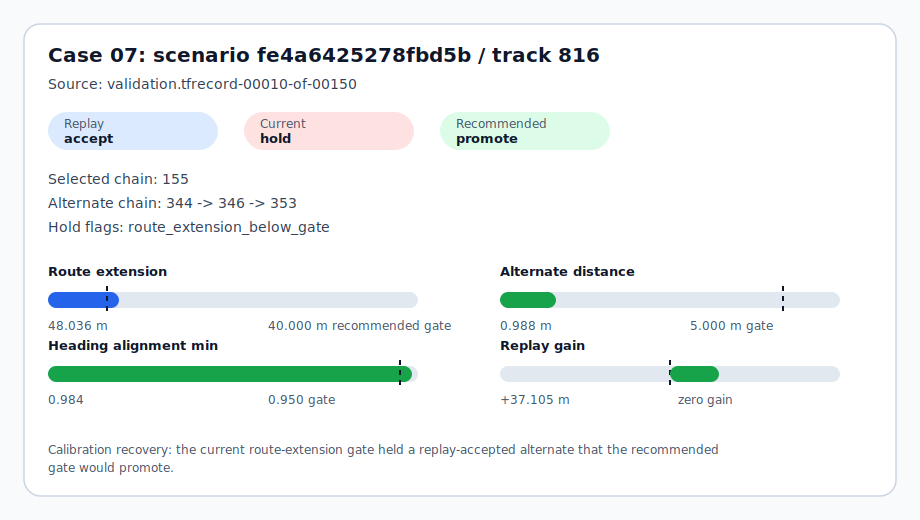

# ScenarioLens Terminal-Neighborhood Selector Casebook

This casebook turns the expanded terminal-neighborhood replay and selector-calibration queue into 7 visual decision cards. Each card explains why a nearby lane alternate is promoted or held using only derived metrics: replay gain, route extension, heading alignment, alternate-lane distance, and selector gate outcomes.

It is intentionally narrow: this is not a route planner, not a default scorer change, and not a Waymo benchmark claim.

## Scope

- Selector calibration manifest: `data/processed/waymo_lane_continuation_terminal_neighborhood_selector_calibration_200/manifest.json`
- Terminal-neighborhood replay manifest: `data/processed/waymo_lane_continuation_terminal_neighborhood_replay_200/manifest.json`
- Terminal-neighborhood audit manifest: `data/processed/waymo_lane_continuation_terminal_neighborhood_audit_200/manifest.json`
- Topology manifest: `data/processed/waymo_lane_continuation_topology_gap_audit_200/manifest.json`
- Ready for casebook: True
- Replay cases: 7
- Replay-gate accepted cases: 5
- Replay-gate held cases: 2
- Policy candidates swept: 30
- Visual cards: 7
- Raw scenario data committed: no
- Raw map geometry published: no
- Visual cards are derived metric diagrams, not trajectory or map overlays.

## Decision Summary

| Metric | Current | Recommended |
| --- | ---: | ---: |
| Max alternate distance | 5.000 m | 5.000 m |
| Minimum heading alignment | 0.950 | 0.700 |
| Minimum route extension | 50.000 m | 40.000 m |
| Promoted candidates | 2 | 4 |
| Held candidates | 5 | 3 |
| Replay-gate matches | 4 | 6 |
| False promotions | 0 | 0 |
| False holds | 3 | 1 |

## Case Index

| Case | Scenario | Track | Replay gate | Current | Recommended | Gain | Route extension | Visual |
| --- | --- | --- | --- | --- | --- | ---: | ---: | --- |
| Case 01 | `2f366a31ab03f8b` | `1061` | `accept_for_selector_experiment` | `promote_terminal_neighborhood_alternate` | `promote_terminal_neighborhood_alternate` | +125.481 m | 228.779 m | [card](assets/terminal_selector_casebook_200_01.svg) |
| Case 02 | `74a5b3325a534a87` | `3178` | `hold_recovery_regressed` | `hold_for_terminal_neighborhood_context` | `hold_for_terminal_neighborhood_context` | -15.163 m | 72.451 m | [card](assets/terminal_selector_casebook_200_02.svg) |
| Case 03 | `28f34edeb361e955` | `987` | `accept_for_selector_experiment` | `hold_for_terminal_neighborhood_context` | `promote_terminal_neighborhood_alternate` | +26.119 m | 56.882 m | [card](assets/terminal_selector_casebook_200_03.svg) |
| Case 04 | `634b468a246a77d6` | `116` | `hold_recovery_regressed` | `hold_for_terminal_neighborhood_context` | `hold_for_terminal_neighborhood_context` | -16.230 m | 32.514 m | [card](assets/terminal_selector_casebook_200_04.svg) |
| Case 05 | `8abe59aee39f351e` | `4650` | `accept_for_selector_experiment` | `promote_terminal_neighborhood_alternate` | `promote_terminal_neighborhood_alternate` | +16.623 m | 81.794 m | [card](assets/terminal_selector_casebook_200_05.svg) |
| Case 06 | `9c8241f6a2ee5f51` | `88` | `accept_for_selector_experiment` | `hold_for_terminal_neighborhood_context` | `hold_for_terminal_neighborhood_context` | +38.890 m | 70.140 m | [card](assets/terminal_selector_casebook_200_06.svg) |
| Case 07 | `fe4a6425278fbd5b` | `816` | `accept_for_selector_experiment` | `hold_for_terminal_neighborhood_context` | `promote_terminal_neighborhood_alternate` | +37.105 m | 48.036 m | [card](assets/terminal_selector_casebook_200_07.svg) |

## Case 01: `2f366a31ab03f8b` / track `1061`

- Source: `validation.tfrecord-00007-of-00150`
- Decision read: Clean recovery: current gates already promote the replay-accepted alternate.
- Replay label: **accept_for_selector_experiment** with +125.481 m nominal gain.
- Current selector: **promote_terminal_neighborhood_alternate**; recommended calibration: **promote_terminal_neighborhood_alternate**.
- Selected chain: 219; alternate chain: 220 -> 210.
- Alternate distance / heading min / route extension: 3.534 m / 1.000 / 228.779 m.
- Hold flags: none.
- Next action: Keep as the positive control for future terminal-neighborhood queues.

Selector checks:

| Check | Passed |
| --- | --- |
| Alternate distance gate | True |
| Selected heading gate | True |
| Alternate heading gate | True |
| Route-extension gate | True |
| Chain-extension gate | True |

## Case 02: `74a5b3325a534a87` / track `3178`

- Source: `validation.tfrecord-00010-of-00150`
- Decision read: Negative control: replay regressed, and the selector correctly keeps the case held.
- Replay label: **hold_recovery_regressed** with -15.163 m nominal gain.
- Current selector: **hold_for_terminal_neighborhood_context**; recommended calibration: **hold_for_terminal_neighborhood_context**.
- Selected chain: 333; alternate chain: 331 -> 205.
- Alternate distance / heading min / route extension: 2.533 m / 0.690 / 72.451 m.
- Hold flags: selected_heading_below_gate, alternate_heading_below_gate.
- Next action: Keep as negative coverage for selector calibration.

Selector checks:

| Check | Passed |
| --- | --- |
| Alternate distance gate | True |
| Selected heading gate | False |
| Alternate heading gate | False |
| Route-extension gate | True |
| Chain-extension gate | True |

## Case 03: `28f34edeb361e955` / track `987`

- Source: `validation.tfrecord-00009-of-00150`
- Decision read: Calibration recovery: the current route-extension gate held a replay-accepted alternate that the recommended gate would promote.
- Replay label: **accept_for_selector_experiment** with +26.119 m nominal gain.
- Current selector: **hold_for_terminal_neighborhood_context**; recommended calibration: **promote_terminal_neighborhood_alternate**.
- Selected chain: 158; alternate chain: 157 -> 156 -> 162.
- Alternate distance / heading min / route extension: 4.719 m / 0.886 / 56.882 m.
- Hold flags: alternate_heading_below_gate.
- Next action: Retest on broader shards before adopting the relaxed route-extension gate.

Selector checks:

| Check | Passed |
| --- | --- |
| Alternate distance gate | True |
| Selected heading gate | True |
| Alternate heading gate | False |
| Route-extension gate | True |
| Chain-extension gate | True |

## Case 04: `634b468a246a77d6` / track `116`

- Source: `validation.tfrecord-00010-of-00150`
- Decision read: Negative control: replay regressed, and the selector correctly keeps the case held.
- Replay label: **hold_recovery_regressed** with -16.230 m nominal gain.
- Current selector: **hold_for_terminal_neighborhood_context**; recommended calibration: **hold_for_terminal_neighborhood_context**.
- Selected chain: 99; alternate chain: 85 -> 89.
- Alternate distance / heading min / route extension: 0.269 m / 0.823 / 32.514 m.
- Hold flags: alternate_heading_below_gate, route_extension_below_gate.
- Next action: Keep as negative coverage for selector calibration.

Selector checks:

| Check | Passed |
| --- | --- |
| Alternate distance gate | True |
| Selected heading gate | True |
| Alternate heading gate | False |
| Route-extension gate | False |
| Chain-extension gate | True |

## Case 05: `8abe59aee39f351e` / track `4650`

- Source: `validation.tfrecord-00010-of-00150`
- Decision read: Clean recovery: current gates already promote the replay-accepted alternate.
- Replay label: **accept_for_selector_experiment** with +16.623 m nominal gain.
- Current selector: **promote_terminal_neighborhood_alternate**; recommended calibration: **promote_terminal_neighborhood_alternate**.
- Selected chain: 161; alternate chain: 143 -> 174.
- Alternate distance / heading min / route extension: 4.426 m / 0.999 / 81.794 m.
- Hold flags: none.
- Next action: Keep as the positive control for future terminal-neighborhood queues.

Selector checks:

| Check | Passed |
| --- | --- |
| Alternate distance gate | True |
| Selected heading gate | True |
| Alternate heading gate | True |
| Route-extension gate | True |
| Chain-extension gate | True |

## Case 06: `9c8241f6a2ee5f51` / track `88`

- Source: `validation.tfrecord-00008-of-00150`
- Decision read: Held for additional route or map-neighborhood context.
- Replay label: **accept_for_selector_experiment** with +38.890 m nominal gain.
- Current selector: **hold_for_terminal_neighborhood_context**; recommended calibration: **hold_for_terminal_neighborhood_context**.
- Selected chain: 223; alternate chain: 237 -> 234 -> 130.
- Alternate distance / heading min / route extension: 2.070 m / 0.122 / 70.140 m.
- Hold flags: selected_heading_below_gate, alternate_heading_below_gate.
- Next action: Hold until more terminal-neighborhood replay evidence is available.

Selector checks:

| Check | Passed |
| --- | --- |
| Alternate distance gate | True |
| Selected heading gate | False |
| Alternate heading gate | False |
| Route-extension gate | True |
| Chain-extension gate | True |

## Case 07: `fe4a6425278fbd5b` / track `816`

- Source: `validation.tfrecord-00010-of-00150`
- Decision read: Calibration recovery: the current route-extension gate held a replay-accepted alternate that the recommended gate would promote.
- Replay label: **accept_for_selector_experiment** with +37.105 m nominal gain.
- Current selector: **hold_for_terminal_neighborhood_context**; recommended calibration: **promote_terminal_neighborhood_alternate**.
- Selected chain: 155; alternate chain: 344 -> 346 -> 353.
- Alternate distance / heading min / route extension: 0.988 m / 0.984 / 48.036 m.
- Hold flags: route_extension_below_gate.
- Next action: Retest on broader shards before adopting the relaxed route-extension gate.

Selector checks:

| Check | Passed |
| --- | --- |
| Alternate distance gate | True |
| Selected heading gate | True |
| Alternate heading gate | True |
| Route-extension gate | False |
| Chain-extension gate | True |

## Interpretation

- The 4 promoted cases are replay-accepted recoveries under the recommended calibration, not default production behavior.
- The 3 held cases are useful negative controls: low heading alignment, short route extension, or too much alternate-lane distance prevents over-promotion.
- The visual cards make the selector failure modes inspectable without committing raw Waymo trajectories or map geometry.
- The next stronger validation step is to broaden terminal-neighborhood replay coverage across more shards before changing default scoring behavior.
