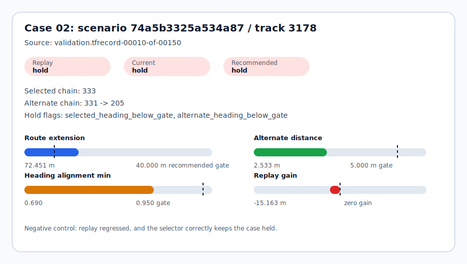
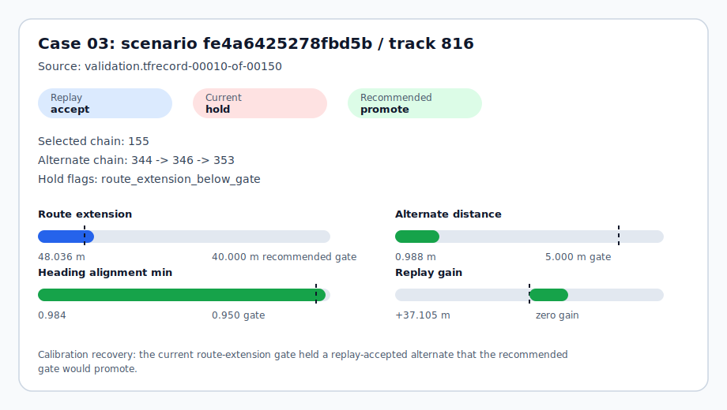
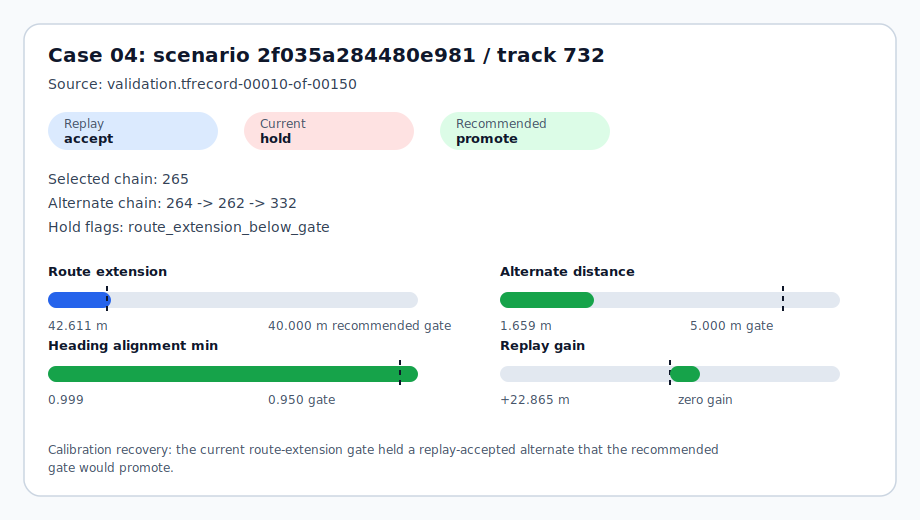
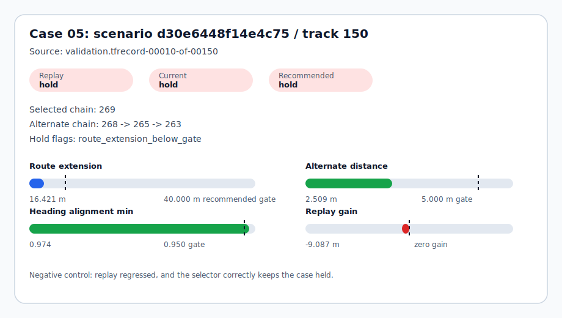
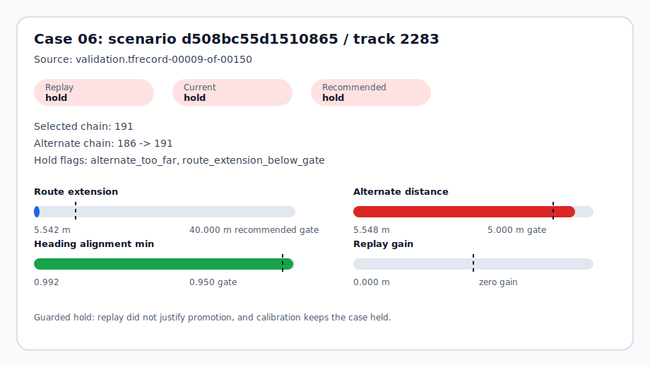

# ScenarioLens Terminal-Neighborhood Selector Casebook

This casebook turns the expanded terminal-neighborhood replay and selector-calibration queue into 6 visual decision cards. Each card explains why a nearby lane alternate is promoted or held using only derived metrics: replay gain, route extension, heading alignment, alternate-lane distance, and selector gate outcomes.

It is intentionally narrow: this is not a route planner, not a default scorer change, and not a Waymo benchmark claim.

## Scope

- Selector calibration manifest: `data/processed/waymo_lane_continuation_terminal_neighborhood_selector_calibration_expanded/manifest.json`
- Terminal-neighborhood replay manifest: `data/processed/waymo_lane_continuation_terminal_neighborhood_replay_expanded/manifest.json`
- Terminal-neighborhood audit manifest: `data/processed/waymo_lane_continuation_terminal_neighborhood_audit_expanded/manifest.json`
- Topology manifest: `data/processed/waymo_lane_continuation_topology_gap_audit_expanded/manifest.json`
- Ready for casebook: True
- Replay cases: 6
- Replay-gate accepted cases: 3
- Replay-gate held cases: 3
- Policy candidates swept: 30
- Visual cards: 6
- Raw scenario data committed: no
- Raw map geometry published: no
- Visual cards are derived metric diagrams, not trajectory or map overlays.

## Decision Summary

| Metric | Current | Recommended |
| --- | ---: | ---: |
| Max alternate distance | 5.000 m | 5.000 m |
| Minimum heading alignment | 0.950 | 0.950 |
| Minimum route extension | 50.000 m | 40.000 m |
| Promoted candidates | 1 | 3 |
| Held candidates | 5 | 3 |
| Replay-gate matches | 4 | 6 |
| False promotions | 0 | 0 |
| False holds | 2 | 0 |

## Case Index

| Case | Scenario | Track | Replay gate | Current | Recommended | Gain | Route extension | Visual |
| --- | --- | --- | --- | --- | --- | ---: | ---: | --- |
| Case 01 | `2f366a31ab03f8b` | `1061` | `accept_for_selector_experiment` | `promote_terminal_neighborhood_alternate` | `promote_terminal_neighborhood_alternate` | +125.481 m | 228.779 m | [card](assets/terminal_selector_casebook_01.svg) |
| Case 02 | `74a5b3325a534a87` | `3178` | `hold_recovery_regressed` | `hold_for_terminal_neighborhood_context` | `hold_for_terminal_neighborhood_context` | -15.163 m | 72.451 m | [card](assets/terminal_selector_casebook_02.svg) |
| Case 03 | `fe4a6425278fbd5b` | `816` | `accept_for_selector_experiment` | `hold_for_terminal_neighborhood_context` | `promote_terminal_neighborhood_alternate` | +37.105 m | 48.036 m | [card](assets/terminal_selector_casebook_03.svg) |
| Case 04 | `2f035a284480e981` | `732` | `accept_for_selector_experiment` | `hold_for_terminal_neighborhood_context` | `promote_terminal_neighborhood_alternate` | +22.865 m | 42.611 m | [card](assets/terminal_selector_casebook_04.svg) |
| Case 05 | `d30e6448f14e4c75` | `150` | `hold_recovery_regressed` | `hold_for_terminal_neighborhood_context` | `hold_for_terminal_neighborhood_context` | -9.087 m | 16.421 m | [card](assets/terminal_selector_casebook_05.svg) |
| Case 06 | `d508bc55d1510865` | `2283` | `hold_recovery_regressed` | `hold_for_terminal_neighborhood_context` | `hold_for_terminal_neighborhood_context` | 0.000 m | 5.542 m | [card](assets/terminal_selector_casebook_06.svg) |

## Case 01: `2f366a31ab03f8b` / track `1061`

- Source: `validation.tfrecord-00007-of-00150`
- Decision read: Clean recovery: current gates already promote the replay-accepted alternate.
- Replay label: **accept_for_selector_experiment** with +125.481 m nominal gain.
- Current selector: **promote_terminal_neighborhood_alternate**; recommended calibration: **promote_terminal_neighborhood_alternate**.
- Selected chain: 219; alternate chain: 220 -> 210.
- Alternate distance / heading min / route extension: 3.534 m / 1.000 / 228.779 m.
- Hold flags: none.
- Next action: Keep as the positive control for future terminal-neighborhood queues.

Selector checks:

| Check | Passed |
| --- | --- |
| Alternate distance gate | True |
| Selected heading gate | True |
| Alternate heading gate | True |
| Route-extension gate | True |
| Chain-extension gate | True |

## Case 02: `74a5b3325a534a87` / track `3178`

- Source: `validation.tfrecord-00010-of-00150`
- Decision read: Negative control: replay regressed, and the selector correctly keeps the case held.
- Replay label: **hold_recovery_regressed** with -15.163 m nominal gain.
- Current selector: **hold_for_terminal_neighborhood_context**; recommended calibration: **hold_for_terminal_neighborhood_context**.
- Selected chain: 333; alternate chain: 331 -> 205.
- Alternate distance / heading min / route extension: 2.533 m / 0.690 / 72.451 m.
- Hold flags: selected_heading_below_gate, alternate_heading_below_gate.
- Next action: Keep as negative coverage for selector calibration.

Selector checks:

| Check | Passed |
| --- | --- |
| Alternate distance gate | True |
| Selected heading gate | False |
| Alternate heading gate | False |
| Route-extension gate | True |
| Chain-extension gate | True |

## Case 03: `fe4a6425278fbd5b` / track `816`

- Source: `validation.tfrecord-00010-of-00150`
- Decision read: Calibration recovery: the current route-extension gate held a replay-accepted alternate that the recommended gate would promote.
- Replay label: **accept_for_selector_experiment** with +37.105 m nominal gain.
- Current selector: **hold_for_terminal_neighborhood_context**; recommended calibration: **promote_terminal_neighborhood_alternate**.
- Selected chain: 155; alternate chain: 344 -> 346 -> 353.
- Alternate distance / heading min / route extension: 0.988 m / 0.984 / 48.036 m.
- Hold flags: route_extension_below_gate.
- Next action: Retest on broader shards before adopting the relaxed route-extension gate.

Selector checks:

| Check | Passed |
| --- | --- |
| Alternate distance gate | True |
| Selected heading gate | True |
| Alternate heading gate | True |
| Route-extension gate | False |
| Chain-extension gate | True |

## Case 04: `2f035a284480e981` / track `732`

- Source: `validation.tfrecord-00010-of-00150`
- Decision read: Calibration recovery: the current route-extension gate held a replay-accepted alternate that the recommended gate would promote.
- Replay label: **accept_for_selector_experiment** with +22.865 m nominal gain.
- Current selector: **hold_for_terminal_neighborhood_context**; recommended calibration: **promote_terminal_neighborhood_alternate**.
- Selected chain: 265; alternate chain: 264 -> 262 -> 332.
- Alternate distance / heading min / route extension: 1.659 m / 0.999 / 42.611 m.
- Hold flags: route_extension_below_gate.
- Next action: Retest on broader shards before adopting the relaxed route-extension gate.

Selector checks:

| Check | Passed |
| --- | --- |
| Alternate distance gate | True |
| Selected heading gate | True |
| Alternate heading gate | True |
| Route-extension gate | False |
| Chain-extension gate | True |

## Case 05: `d30e6448f14e4c75` / track `150`

- Source: `validation.tfrecord-00010-of-00150`
- Decision read: Negative control: replay regressed, and the selector correctly keeps the case held.
- Replay label: **hold_recovery_regressed** with -9.087 m nominal gain.
- Current selector: **hold_for_terminal_neighborhood_context**; recommended calibration: **hold_for_terminal_neighborhood_context**.
- Selected chain: 269; alternate chain: 268 -> 265 -> 263.
- Alternate distance / heading min / route extension: 2.509 m / 0.974 / 16.421 m.
- Hold flags: route_extension_below_gate.
- Next action: Keep as negative coverage for selector calibration.

Selector checks:

| Check | Passed |
| --- | --- |
| Alternate distance gate | True |
| Selected heading gate | True |
| Alternate heading gate | True |
| Route-extension gate | False |
| Chain-extension gate | True |

## Case 06: `d508bc55d1510865` / track `2283`

- Source: `validation.tfrecord-00009-of-00150`
- Decision read: Guarded hold: replay did not justify promotion, and calibration keeps the case held.
- Replay label: **hold_recovery_regressed** with 0.000 m nominal gain.
- Current selector: **hold_for_terminal_neighborhood_context**; recommended calibration: **hold_for_terminal_neighborhood_context**.
- Selected chain: 191; alternate chain: 186 -> 191.
- Alternate distance / heading min / route extension: 5.548 m / 0.992 / 5.542 m.
- Hold flags: alternate_too_far, route_extension_below_gate.
- Next action: Keep as negative coverage for selector calibration.

Selector checks:

| Check | Passed |
| --- | --- |
| Alternate distance gate | False |
| Selected heading gate | True |
| Alternate heading gate | True |
| Route-extension gate | False |
| Chain-extension gate | True |

## Interpretation

- The 3 promoted cases are replay-accepted recoveries under the recommended calibration, not default production behavior.
- The 3 held cases are useful negative controls: low heading alignment, short route extension, or too much alternate-lane distance prevents over-promotion.
- The visual cards make the selector failure modes inspectable without committing raw Waymo trajectories or map geometry.
- The next stronger validation step is to broaden terminal-neighborhood replay coverage across more shards before changing default scoring behavior.
